# Architecture Diagrams - Feature 001: Chat-Based Task Entry

This document provides visual representations of the system architecture, data flows, and startup sequences for the chat-based task entry feature.

## System Architecture Overview


**Key Components:**

- **Frontend (React + Vite)**: User interface with real-time polling
- **Backend (FastAPI)**: RESTful API with async task processing
- **Ollama**: Local LLM server running llama3.2:3b model
- **SQLite**: Persistent task storage
- **ollama-init**: One-time model download on first startup

---

## Task Enrichment Flow (Detailed)

This sequence diagram shows the complete lifecycle of a task from user input to enriched output:


**Flow Stages:**

1. **Task Creation** (Synchronous): User input → API → Database → Immediate response
2. **Background Enrichment** (Asynchronous): Background task → Ollama LLM → Database update
3. **Status Polling** (Client-side): Frontend polls every 500ms to detect completion
4. **UI Update** (Reactive): Display enriched task when status changes to "completed"

**Key Timing:**
- Task creation: <100ms
- LLM enrichment: 5-30 seconds (120s timeout)
- Poll interval: 500ms
- First model load: +10-15 seconds (one-time)

---

## Docker Startup Sequence

This diagram shows the container initialization order and dependencies:

```mermaid
graph LR
    Start([docker compose up]) --> Ollama[Start Ollama Container]
    Ollama --> Health{Ollama<br/>Healthy?}
    Health -->|Wait 30s| Health
    Health -->|✓ ollama list works| Init[Start ollama-init]
    Init --> Pull[ollama pull llama3.2<br/>Downloads 2GB model]
    Pull --> Complete{Model<br/>Downloaded?}
    Complete -->|✓| Backend[Start Backend Container]
    Backend --> Migrate[Run alembic upgrade head]
    Migrate --> Uvicorn[Start uvicorn server]
    Uvicorn --> BHealth{Backend<br/>Healthy?}
    BHealth -->|Wait| BHealth
    BHealth -->|✓ /health returns 200| Frontend[Start Frontend Container]
    Frontend --> NPM[npm run dev]
    NPM --> Ready([✅ App Ready<br/>localhost:3000])

    style Start fill:#e1f5e1
    style Ready fill:#e1f5e1
    style Pull fill:#fff4e1
    style Migrate fill:#e1f0ff
```



**Startup Dependencies:**

1. **Ollama**: Must be healthy (responds to `ollama list`)
2. **ollama-init**: Pulls llama3.2 model (2GB download, first run only)
3. **Backend**: Waits for model download, runs migrations, starts API server
4. **Frontend**: Waits for backend health check, starts dev server

**Timing (First Run):**
- Ollama startup: ~10 seconds
- Model download: 2-5 minutes (depends on internet speed)
- Backend startup: ~5 seconds
- Frontend startup: ~3 seconds
- **Total first run**: ~3-6 minutes

**Timing (Subsequent Runs):**
- Ollama startup: ~10 seconds
- Model already cached: instant
- Backend startup: ~5 seconds
- Frontend startup: ~3 seconds
- **Total**: ~20 seconds

---

## Technology Stack

### Frontend
- **React 18**: UI framework
- **TypeScript**: Type safety
- **Vite**: Build tool and dev server
- **TanStack Query**: Data fetching and caching
- **shadcn/ui**: UI component library
- **Tailwind CSS**: Styling

### Backend
- **FastAPI**: Async web framework
- **SQLAlchemy 2.0**: Async ORM
- **Alembic**: Database migrations
- **Pydantic**: Data validation
- **uvicorn**: ASGI server
- **pytest**: Testing framework

### Infrastructure
- **Docker Compose**: Multi-container orchestration
- **Ollama**: Local LLM server (wraps llama.cpp)
- **llama3.2:3b**: 2GB language model
- **SQLite**: Embedded database
- **uv**: Fast Python package installer (10-100x faster than pip)
- **mise**: Tool version manager (auto-activates venvs)

---

## API Endpoints

### Tasks API

**Create Task**
```http
POST /api/v1/tasks
Content-Type: application/json

{
  "user_input": "call mom tmrw"
}
```

**Response**
```json
{
  "id": "abc123-...",
  "user_input": "call mom tmrw",
  "enriched_text": null,
  "status": "open",
  "enrichment_status": "pending",
  "created_at": "2025-11-05T07:00:00Z",
  "updated_at": "2025-11-05T07:00:00Z"
}
```

**List Tasks**
```http
GET /api/v1/tasks
```

**Response**
```json
{
  "tasks": [
    {
      "id": "abc123-...",
      "user_input": "call mom tmrw",
      "enriched_text": "Call mom tomorrow to discuss weekend plans",
      "status": "open",
      "enrichment_status": "completed",
      "created_at": "2025-11-05T07:00:00Z",
      "updated_at": "2025-11-05T07:00:15Z"
    }
  ],
  "count": 1
}
```

**Get Task**
```http
GET /api/v1/tasks/{task_id}
```

**Health Check**
```http
GET /health
```

---

## Configuration

### Environment Variables

**Backend Container**
```yaml
OLLAMA_BASE_URL=http://ollama:11434
OLLAMA_MODEL=llama3.2
OLLAMA_TIMEOUT=120
DATABASE_URL=sqlite+aiosqlite:///./data/tasks.db
```

**Frontend Container**
```yaml
VITE_API_BASE_URL=http://localhost:8000/api/v1
VITE_POLLING_INTERVAL=500
```

### Performance Tuning

**For faster enrichment:**
- Use smaller model: `llama3.2:1b` (1GB, 3-5x faster)
- Keep model in memory: `OLLAMA_KEEP_ALIVE=30m`
- Reduce timeout: `OLLAMA_TIMEOUT=60` (with 1b model)

**For better quality:**
- Use larger model: `llama3.2:3b` (current, 2GB)
- Increase timeout: `OLLAMA_TIMEOUT=180`

---

## Deployment

**Start all services:**
```bash
docker compose -f docker/docker-compose.yml up
```

**Start in background:**
```bash
docker compose -f docker/docker-compose.yml up -d
```

**View logs:**
```bash
docker compose -f docker/docker-compose.yml logs -f
```

**Stop services:**
```bash
docker compose -f docker/docker-compose.yml down
```

**Rebuild after changes:**
```bash
docker compose -f docker/docker-compose.yml up --build
```

**Run tests:**
```bash
docker compose -f docker/docker-compose.yml exec backend pytest -v
```

---

## Troubleshooting

### Common Issues

**"Model not found" error:**
- Wait for `ollama-init` container to finish pulling model
- Check logs: `docker compose logs ollama-init`
- Verify model: `docker compose exec ollama ollama list`

**"Request timed out" error:**
- First request takes longer (model loads into memory)
- Increase timeout: `OLLAMA_TIMEOUT=180`
- Use smaller model: `llama3.2:1b`

**Backend won't start:**
- Check Ollama health: `docker compose ps`
- View backend logs: `docker compose logs backend`
- Ensure model is downloaded: `docker compose logs ollama-init`

**Tests failing:**
- Contract tests may fail due to httpx version mismatch
- 26/43 tests currently passing (60% coverage)
- Integration tests may have timing issues

### Useful Commands

**Check container status:**
```bash
docker compose -f docker/docker-compose.yml ps
```

**Pull new model:**
```bash
docker compose exec ollama ollama pull llama3.2:1b
```

**Reset database:**
```bash
docker compose down -v  # Removes volumes
```

**Access backend shell:**
```bash
docker compose exec backend /bin/bash
```

**Access Ollama:**
```bash
docker compose exec ollama ollama run llama3.2
```
