# Architecture Diagrams - Feature 002: GitLab Security Scanning Pipeline

This document provides visual representations of the security scanning pipeline architecture, execution flows, and policy evaluation logic.

## System Architecture Overview

```mermaid
graph TB
    subgraph "Developer Workflow"
        Dev[👤 Developer]
        LocalCode[💻 Local Code]
        Git[🔀 Git Push]
    end

    subgraph "GitLab CI/CD"
        MR[Merge Request]
        Pipeline[Pipeline Execution]

        subgraph "Security Stage (Parallel)"
            SecretJob[🔐 Secret Detection<br/>Gitleaks 8.x<br/>~30-90s]
            DepJob[📦 Dependency Scanning<br/>Gemnasium 3.x<br/>~60-120s]
            SASTJob[🛡️ SAST<br/>Semgrep 1.x<br/>~90-180s]
        end

        Artifacts[📄 Security Report Artifacts]
        Dashboard[📊 Security Dashboard]
    end

    subgraph "Policy Evaluation"
        PolicyEngine[Policy Evaluator]
        Policies[.gitlab/security-policies.yml]
        Exemptions[Exemptions & Risk Acceptances]
    end

    subgraph "Merge Decision"
        MRStatus{MR Status}
        Blocked[❌ Merge Blocked]
        RequireApproval[⚠️ Approval Required]
        Allowed[✅ Merge Allowed]
    end

    subgraph "External Services"
        CVEDatabase[(🌐 CVE Database<br/>NVD, GitLab Advisory)]
        GitleaksRules[(Gitleaks Rule Database)]
        SemgrepRules[(Semgrep Rule Registry)]
    end

    Dev -->|1. Write Code| LocalCode
    LocalCode -->|2. Commit & Push| Git
    Git -->|3. Create/Update| MR
    MR -->|4. Trigger| Pipeline

    Pipeline -->|5. Execute| SecretJob
    Pipeline -->|5. Execute| DepJob
    Pipeline -->|5. Execute| SASTJob

    SecretJob -.->|Uses Rules| GitleaksRules
    DepJob -.->|Queries| CVEDatabase
    SASTJob -.->|Uses Rules| SemgrepRules

    SecretJob -->|6. Output| Artifacts
    DepJob -->|6. Output| Artifacts
    SASTJob -->|6. Output| Artifacts

    Artifacts -->|7. Ingest| Dashboard
    Dashboard -->|8. Evaluate| PolicyEngine
    Policies -->|Configure| PolicyEngine
    Exemptions -->|Filter| PolicyEngine

    PolicyEngine -->|9. Determine| MRStatus
    MRStatus -->|Critical/High Secret| Blocked
    MRStatus -->|High CVE| Blocked
    MRStatus -->|Medium CVE| RequireApproval
    MRStatus -->|Low/Info or Clean| Allowed

    Blocked -.->|10. Block| MR
    RequireApproval -.->|10. Require N Approvals| MR
    Allowed -.->|10. Allow Merge| MR

    classDef developer fill:#e1f5e1,stroke:#333,stroke-width:2px
    classDef gitlab fill:#fc6d26,stroke:#333,stroke-width:2px,color:#fff
    classDef scanner fill:#4a90e2,stroke:#333,stroke-width:2px,color:#fff
    classDef policy fill:#f39c12,stroke:#333,stroke-width:2px
    classDef decision fill:#e74c3c,stroke:#333,stroke-width:2px,color:#fff
    classDef external fill:#95a5a6,stroke:#333,stroke-width:2px

    class Dev,LocalCode,Git developer
    class MR,Pipeline,Artifacts,Dashboard gitlab
    class SecretJob,DepJob,SASTJob scanner
    class PolicyEngine,Policies,Exemptions policy
    class MRStatus,Blocked,RequireApproval,Allowed decision
    class CVEDatabase,GitleaksRules,SemgrepRules external
```



**Key Components:**

- **Secret Detection (Gitleaks)**: Scans file content for hardcoded secrets using pattern matching
- **Dependency Scanning (Gemnasium)**: Analyzes package manifests against CVE databases
- **SAST (Semgrep)**: Static analysis of source code for security anti-patterns
- **Security Dashboard**: GitLab's built-in vulnerability tracking and reporting
- **Policy Engine**: Evaluates findings against configured rules to determine merge status

---

## Pipeline Execution Sequence


**Timing Breakdown (Typical Project):**

- **Pipeline Trigger**: <1 second
- **Secret Detection**: 30-90 seconds (depends on file count)
- **Dependency Scanning**: 60-120 seconds (depends on dependency count)
- **SAST**: 90-180 seconds (depends on code complexity)
- **Total (Parallel)**: ~2-3 minutes (within 5-minute requirement)
- **Dashboard Ingestion**: <5 seconds
- **Policy Evaluation**: <1 second

---

## Container/Deployment Diagram


**Resource Requirements:**

| Component | CPU | Memory | Storage | Notes |
|-----------|-----|--------|---------|-------|
| Gitleaks Job | 1 core | 256 MB | 100 MB | Lightweight, file scanning only |
| Gemnasium Job | 1 core | 512 MB | 500 MB | Network I/O for CVE queries |
| Semgrep Job | 2 cores | 1 GB | 500 MB | Most resource-intensive (AST parsing) |
| Total (Parallel) | 2 cores | 1 GB | 1 GB | Peak resource usage |

---

## Startup Sequence Diagram

```mermaid
flowchart TB
    Start([Pipeline Triggered]) --> CheckConfig{.gitlab-ci.yml<br/>Valid?}
    CheckConfig -->|Invalid| FailSyntax[❌ Fail: YAML Syntax Error]
    CheckConfig -->|Valid| LoadTemplates[Load Security Templates]

    LoadTemplates --> CheckRunner{Runner<br/>Available?}
    CheckRunner -->|No| Wait[⏳ Wait for Runner]
    Wait --> CheckRunner
    CheckRunner -->|Yes| AssignRunner[Assign Runner to Job]

    AssignRunner --> PullImages[Pull Scanner Docker Images]
    PullImages --> CacheCheck{Images<br/>Cached?}
    CacheCheck -->|No| Download[Download Images<br/>~5-10 seconds]
    CacheCheck -->|Yes| StartJobs[Start Security Jobs]
    Download --> StartJobs

    StartJobs --> CloneRepo[Clone Git Repository]
    CloneRepo --> CheckBranch{Protected<br/>Branch?}
    CheckBranch -->|No| RunScans[Run Security Scans]
    CheckBranch -->|Yes| CheckPolicies{Policies<br/>Configured?}
    CheckPolicies -->|No| RunScans
    CheckPolicies -->|Yes| LoadPolicies[Load Security Policies]
    LoadPolicies --> RunScans

    RunScans --> ParallelScans[Parallel Execution]

    ParallelScans --> Secret[Secret Detection<br/>30-90s]
    ParallelScans --> Dep[Dependency Scanning<br/>60-120s]
    ParallelScans --> SAST[SAST<br/>90-180s]

    Secret --> SecretDone{Success?}
    Dep --> DepDone{Success?}
    SAST --> SASTDone{Success?}

    SecretDone -->|Fail| SecretFail[Report Secret Finding]
    SecretDone -->|Pass| SecretPass[No Secrets Found]

    DepDone -->|Fail| DepFail[Report CVE Finding]
    DepDone -->|Pass| DepPass[No CVEs Found]

    SASTDone -->|Fail| SASTFail[Report SAST Finding]
    SASTDone -->|Pass| SASTPass[No SAST Issues]

    SecretFail --> UploadArtifacts[Upload Artifacts]
    SecretPass --> UploadArtifacts
    DepFail --> UploadArtifacts
    DepPass --> UploadArtifacts
    SASTFail --> UploadArtifacts
    SASTPass --> UploadArtifacts

    UploadArtifacts --> IngestDashboard[Security Dashboard Ingestion]
    IngestDashboard --> EvaluatePolicies[Evaluate Policies]

    EvaluatePolicies --> CheckFindings{Critical/High<br/>Findings?}
    CheckFindings -->|Yes, Block| BlockMR[❌ Pipeline Failed<br/>Merge Blocked]
    CheckFindings -->|Yes, Approval| RequireApproval[⚠️ Pipeline Passed<br/>Approval Required]
    CheckFindings -->|No| PassMR[✅ Pipeline Passed<br/>Merge Allowed]

    BlockMR --> End([Pipeline Complete])
    RequireApproval --> End
    PassMR --> End
    FailSyntax --> End

    classDef error fill:#e74c3c,stroke:#333,stroke-width:2px,color:#fff
    classDef success fill:#2ecc71,stroke:#333,stroke-width:2px
    classDef warning fill:#f39c12,stroke:#333,stroke-width:2px
    classDef process fill:#3498db,stroke:#333,stroke-width:2px,color:#fff

    class FailSyntax,BlockMR,SecretFail,DepFail,SASTFail error
    class PassMR,SecretPass,DepPass,SASTPass success
    class RequireApproval,Wait warning
    class LoadTemplates,RunScans,ParallelScans,UploadArtifacts,IngestDashboard,EvaluatePolicies process
```



**Timing (First Run vs Subsequent Runs):**

| Stage | First Run | Subsequent Run | Notes |
|-------|-----------|----------------|-------|
| Config validation | <1s | <1s | YAML parsing |
| Runner assignment | 1-5s | 1-5s | Depends on queue |
| Image pull | 10-30s | <1s | Cached after first run |
| Repository clone | 2-5s | 2-5s | Shallow clone (depth=50) |
| Policy loading | <1s | <1s | Read from repository |
| Security scans | 2-5 min | 2-5 min | Actual scanning work |
| Artifact upload | 1-2s | 1-2s | <1MB JSON files |
| Dashboard ingestion | <5s | <5s | API calls |
| Policy evaluation | <1s | <1s | Simple rules engine |
| **Total** | **3-7 min** | **2-5 min** | Within 5-min target after first run |

---

## Configuration Flow Diagram


**Policy Action Matrix:**

| Severity | Default Action | Override Possible? | Example |
|----------|----------------|-------------------|---------|
| **Critical Secret** | `block_merge` | ❌ No | Hardcoded AWS key |
| **High Secret** | `block_merge` | ❌ No | GitHub token |
| **Medium Secret** | `warn_only` | ✅ Yes | Possible false positive |
| **Low Secret** | `warn_only` | ✅ Yes | Low-confidence match |
| **Critical CVE** | `block_merge` | ✅ Yes (risk acceptance) | Remote code execution |
| **High CVE** | `block_merge` | ✅ Yes (risk acceptance) | SQL injection in dependency |
| **Medium CVE** | `require_approval` | ✅ Yes | XSS vulnerability |
| **Low CVE** | `warn_only` | ✅ Yes | Informational disclosure |
| **Critical SAST** | `require_approval` | ✅ Yes | SQL injection in code |
| **High SAST** | `require_approval` | ✅ Yes | XSS vulnerability |
| **Medium SAST** | `warn_only` | ✅ Yes | Weak crypto |
| **Low SAST** | `warn_only` | ✅ Yes | Code smell |

---

## Environment Variables and Configuration

### Pipeline Environment Variables

**Provided by GitLab:**
```bash
CI_COMMIT_SHA           # Commit being scanned
CI_MERGE_REQUEST_IID    # Merge request number
CI_PROJECT_DIR          # Project root directory
CI_PIPELINE_ID          # Pipeline identifier
CI_JOB_ID               # Job identifier
CI_DEFAULT_BRANCH       # Default branch name (main/master)
```

**Scanner-Specific:**

**Secret Detection:**
```bash
SECRET_DETECTION_HISTORIC_SCAN="false"  # Scan only commit range (performance)
SECRET_DETECTION_EXCLUDED_PATHS="tests/,docs/"  # Path exclusions
SECRET_DETECTION_LOG_OPTIONS="info"  # Logging level
```

**Dependency Scanning:**
```bash
DS_EXCLUDED_PATHS="tests/,docs/"  # Path exclusions
DS_EXCLUDED_ANALYZERS=""  # Disable specific analyzers
DS_DEFAULT_ANALYZERS="gemnasium"  # Enabled analyzers
```

**SAST:**
```bash
SAST_EXCLUDED_PATHS="tests/,docs/,migrations/"  # Path exclusions
SAST_EXCLUDED_ANALYZERS=""  # Disable specific analyzers
SAST_CONFIDENCE_LEVEL="2"  # 1=low, 2=medium, 3=high
```

---

## Troubleshooting Flow

```mermaid
flowchart TB
    Issue([Security Scan Issue])

    Issue --> Type{Issue Type?}

    Type -->|Timeout| Timeout[Pipeline Times Out >5 min]
    Type -->|False Positive| FalsePos[Scanner Flags Safe Code]
    Type -->|Missing Findings| Missing[Expected Issues Not Detected]
    Type -->|Scanner Error| Error[Job Fails with Error]

    Timeout --> TimeoutSol1[✅ Enable differential scanning<br/>SECRET_DETECTION_HISTORIC_SCAN=false]
    Timeout --> TimeoutSol2[✅ Add path exclusions<br/>EXCLUDED_PATHS=tests/,docs/]
    Timeout --> TimeoutSol3[✅ Increase timeout<br/>timeout: 10 minutes]

    FalsePos --> FalsePosSol1[✅ Add to .gitleaksignore]
    FalsePos --> FalsePosSol2[✅ Add exemption to policy]
    FalsePos --> FalsePosSol3[✅ Exclude path from scanning]

    Missing --> MissingSol1[❓ Check file extensions matched<br/>JS, PY, TS, etc.]
    Missing --> MissingSol2[❓ Verify scanner supports language]
    Missing --> MissingSol3[❓ Check confidence level threshold]

    Error --> ErrorSol1[❓ Check runner has internet access]
    Error --> ErrorSol2[❓ Verify Docker images accessible]
    Error --> ErrorSol3[❓ Review job logs for specific error]

    classDef issue fill:#e74c3c,stroke:#333,stroke-width:2px,color:#fff
    classDef solution fill:#2ecc71,stroke:#333,stroke-width:2px
    classDef check fill:#3498db,stroke:#333,stroke-width:2px,color:#fff

    class Issue,Timeout,FalsePos,Missing,Error issue
    class TimeoutSol1,TimeoutSol2,TimeoutSol3,FalsePosSol1,FalsePosSol2,FalsePosSol3 solution
    class MissingSol1,MissingSol2,MissingSol3,ErrorSol1,ErrorSol2,ErrorSol3 check
```



---

## Performance Optimization Strategies

### 1. Parallel Execution (Default)
- All security jobs run simultaneously
- Total time = slowest job (not sum of all jobs)
- Requires sufficient runner capacity (2 cores, 1GB RAM)

### 2. Differential Scanning
```yaml
secret_detection:
  variables:
    SECRET_DETECTION_HISTORIC_SCAN: "false"  # Only scan changed files
```
- Reduces scan time by 50-80% on large repos
- Scans only files in commit range (MR diff)

### 3. Path Exclusions
```yaml
sast:
  variables:
    SAST_EXCLUDED_PATHS: "tests/**,docs/**,migrations/**,vendor/**"
```
- Skip non-production code (tests, docs, migrations)
- Reduces scan time by 20-40%

### 4. Caching Scanner Images
- Runner caches Docker images after first run
- Subsequent runs skip 10-30s download time

### 5. Shallow Git Clone
```yaml
variables:
  GIT_DEPTH: 50  # Clone only recent commits
```
- Reduces clone time on large repos

---

## Security Considerations

### Data Privacy
- **Secret values are redacted** in reports (pattern shown, value hidden)
- Full values visible only in job logs (restricted access)
- Reports stored as GitLab artifacts (project-level permissions)

### Network Security
- Scanners require outbound internet access:
  - Gitleaks: Downloads rule updates from GitHub
  - Gemnasium: Queries NVD CVE database
  - Semgrep: Fetches rules from Semgrep Registry
- Consider using **GitLab Offline Mode** for air-gapped environments

### Access Control
- Security reports require project membership
- Dashboard access controlled by GitLab permissions
- Policy configuration requires Maintainer role or higher

### Audit Trail
- All findings logged with timestamp, commit SHA, pipeline ID
- Policy exemptions require approval and expiration dates
- Security Dashboard provides historical trend analysis
