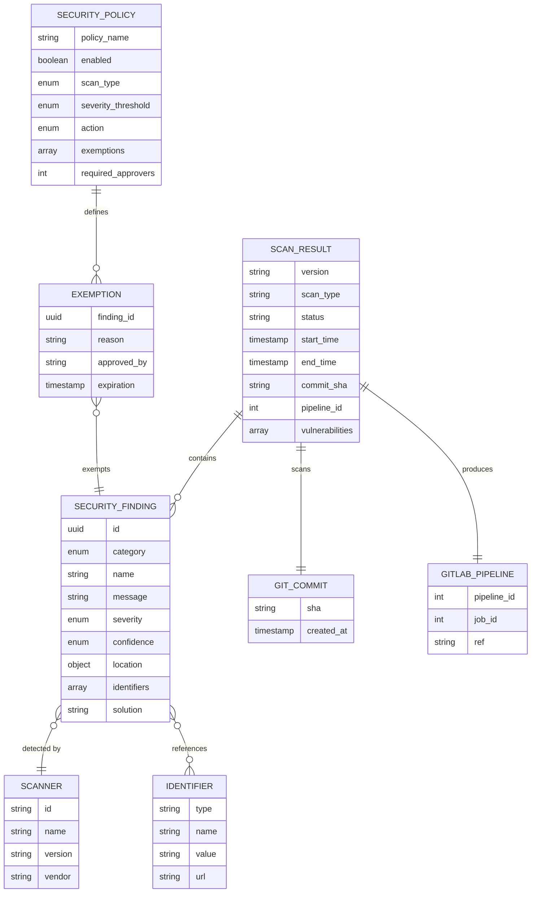
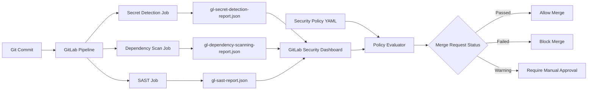

# Data Model: GitLab Security Scanning Pipeline

**Feature**: 002-gitlab-security-pipeline
**Created**: 2025-11-05
**Purpose**: Define data structures for security findings, scan results, and policies

## Overview

This feature does not introduce custom database tables or application-level data structures. Instead, it leverages GitLab's native security report format (JSON artifacts) and dashboard storage. The data model documents the structure of these artifacts and their relationships.

## Entity Definitions

### 1. Security Finding

Represents a single detected security issue from any scanner (Secret Detection, Dependency Scanning, or SAST).

**Source**: GitLab Security Report JSON (common schema for all scanners)

**Attributes**:

| Attribute | Type | Description | Example |
|-----------|------|-------------|---------|
| `id` | string (UUID) | Unique identifier for this finding | `"550e8400-e29b-41d4-a716-446655440000"` |
| `category` | enum | Scanner category | `"secret_detection"`, `"dependency_scanning"`, `"sast"` |
| `name` | string | Human-readable finding name | `"AWS Access Key"`, `"SQL Injection"` |
| `message` | string | Detailed description of the issue | `"Hardcoded AWS access key detected in file"` |
| `severity` | enum | Severity rating | `"critical"`, `"high"`, `"medium"`, `"low"`, `"info"` |
| `confidence` | enum | Confidence level of the finding | `"high"`, `"medium"`, `"low"` |
| `location` | object | File location details (see Location schema) | `{file: "src/config.js", start_line: 42}` |
| `identifiers` | array | External identifiers (CVE, CWE) | `[{type: "cve", name: "CVE-2023-1234"}]` |
| `solution` | string | Remediation guidance | `"Remove hardcoded key, use environment variables"` |
| `scanner` | object | Scanner metadata (see Scanner schema) | `{id: "gitleaks", name: "Gitleaks"}` |

**Location Object**:

```json
{
  "file": "backend/src/auth/credentials.py",
  "start_line": 15,
  "end_line": 15,
  "class": null,
  "method": "authenticate"
}
```

**Scanner Object**:

```json
{
  "id": "gitleaks",
  "name": "Gitleaks",
  "version": "8.18.0"
}
```

**Relationships**:
- Belongs to one **Scan Result** (the pipeline run that produced it)
- May reference one or more external **Identifiers** (CVE, CWE)

---

### 2. Scan Result

Represents the aggregate output of a single pipeline security scan run. Contains metadata and all findings.

**Source**: GitLab Security Report JSON artifact (e.g., `gl-secret-detection-report.json`)

**Attributes**:

| Attribute | Type | Description | Example |
|-----------|------|-------------|---------|
| `version` | string | Security report schema version | `"15.0.0"` |
| `scan.type` | string | Type of scan performed | `"secret_detection"`, `"dependency_scanning"`, `"sast"` |
| `scan.status` | enum | Overall scan status | `"success"`, `"failed"`, `"error"` |
| `scan.start_time` | ISO 8601 timestamp | When the scan began | `"2025-11-05T14:30:00Z"` |
| `scan.end_time` | ISO 8601 timestamp | When the scan completed | `"2025-11-05T14:32:15Z"` |
| `scan.scanner` | object | Scanner tool metadata | `{id: "gitleaks", name: "Gitleaks", version: "8.18.0"}` |
| `vulnerabilities` | array | List of Security Findings | `[{...}, {...}]` |
| `remediations` | array | Suggested fixes (optional) | `[{fixes: [...], summary: "..."}]` |
| `commit_sha` | string (Git SHA) | Commit that was scanned | `"a1b2c3d4e5f6..."` |
| `pipeline_id` | integer | GitLab pipeline ID | `12345` |
| `job_id` | integer | GitLab job ID | `67890` |

**Scan Object**:

```json
{
  "type": "secret_detection",
  "status": "success",
  "start_time": "2025-11-05T14:30:00Z",
  "end_time": "2025-11-05T14:32:15Z",
  "scanner": {
    "id": "gitleaks",
    "name": "Gitleaks",
    "version": "8.18.0",
    "vendor": {
      "name": "GitLab"
    }
  }
}
```

**Relationships**:
- Contains many **Security Findings** (0 to N vulnerabilities)
- Belongs to one GitLab **Pipeline** execution
- Associated with one Git **Commit**

---

### 3. Security Policy

Defines rules for how security findings affect merge request approval. Configured via GitLab Merge Request Approval Policies.

**Source**: `.gitlab/security-policies.yml` (project configuration file)

**Attributes**:

| Attribute | Type | Description | Example |
|-----------|------|-------------|---------|
| `policy_name` | string | Human-readable policy name | `"Block High Severity Secrets"` |
| `enabled` | boolean | Whether policy is active | `true` |
| `scan_type` | enum | Which scanner this applies to | `"secret_detection"`, `"dependency_scanning"`, `"sast"` |
| `severity_threshold` | enum | Minimum severity to trigger action | `"critical"`, `"high"`, `"medium"`, `"low"` |
| `action` | enum | What happens when threshold is met | `"block_merge"`, `"require_approval"`, `"warn_only"` |
| `exemptions` | array | Allowlisted findings (see Exemption schema) | `[{id: "uuid", reason: "false positive"}]` |
| `required_approvers` | integer | Number of approvals needed to override | `2` |

**Exemption Object**:

```json
{
  "finding_id": "550e8400-e29b-41d4-a716-446655440000",
  "reason": "False positive: This is a test API key used in documentation examples",
  "approved_by": "security-team",
  "expiration": "2025-12-31T23:59:59Z"
}
```

**Relationships**:
- Applies to many **Security Findings** (evaluated against each finding)
- References specific findings in **exemptions** list

---

## Entity Relationships



## Data Flow



## JSON Schema Examples

### Secret Detection Report

```json
{
  "version": "15.0.0",
  "scan": {
    "type": "secret_detection",
    "status": "success",
    "start_time": "2025-11-05T14:30:00Z",
    "end_time": "2025-11-05T14:32:15Z",
    "scanner": {
      "id": "gitleaks",
      "name": "Gitleaks",
      "version": "8.18.0",
      "vendor": {
        "name": "GitLab"
      }
    }
  },
  "vulnerabilities": [
    {
      "id": "550e8400-e29b-41d4-a716-446655440000",
      "category": "secret_detection",
      "name": "AWS Access Key",
      "message": "Hardcoded AWS access key detected",
      "severity": "critical",
      "confidence": "high",
      "location": {
        "file": "backend/src/config.py",
        "start_line": 42,
        "end_line": 42
      },
      "identifiers": [
        {
          "type": "gitleaks_rule_id",
          "name": "aws-access-token",
          "value": "aws-access-token"
        }
      ],
      "solution": "Remove hardcoded AWS credentials. Use environment variables or AWS IAM roles instead.",
      "scanner": {
        "id": "gitleaks",
        "name": "Gitleaks"
      }
    }
  ]
}
```

### Dependency Scanning Report

```json
{
  "version": "15.0.0",
  "scan": {
    "type": "dependency_scanning",
    "status": "success",
    "start_time": "2025-11-05T14:30:00Z",
    "end_time": "2025-11-05T14:33:45Z",
    "scanner": {
      "id": "gemnasium",
      "name": "Gemnasium",
      "version": "3.2.0",
      "vendor": {
        "name": "GitLab"
      }
    }
  },
  "vulnerabilities": [
    {
      "id": "660e9500-f39c-52e5-b827-557766551111",
      "category": "dependency_scanning",
      "name": "Prototype Pollution in lodash",
      "message": "The package lodash before 4.17.21 is vulnerable to Prototype Pollution",
      "severity": "high",
      "confidence": "high",
      "location": {
        "file": "package-lock.json",
        "dependency": {
          "package": {
            "name": "lodash"
          },
          "version": "4.17.20"
        }
      },
      "identifiers": [
        {
          "type": "cve",
          "name": "CVE-2020-8203",
          "value": "CVE-2020-8203",
          "url": "https://cve.mitre.org/cgi-bin/cvename.cgi?name=CVE-2020-8203"
        }
      ],
      "solution": "Upgrade lodash to version 4.17.21 or later",
      "scanner": {
        "id": "gemnasium",
        "name": "Gemnasium"
      }
    }
  ]
}
```

### SAST Report

```json
{
  "version": "15.0.0",
  "scan": {
    "type": "sast",
    "status": "success",
    "start_time": "2025-11-05T14:30:00Z",
    "end_time": "2025-11-05T14:35:20Z",
    "scanner": {
      "id": "semgrep",
      "name": "Semgrep",
      "version": "1.45.0",
      "vendor": {
        "name": "GitLab"
      }
    }
  },
  "vulnerabilities": [
    {
      "id": "770fa611-g40d-63f6-c938-668877662222",
      "category": "sast",
      "name": "SQL Injection",
      "message": "Potential SQL injection via string concatenation",
      "severity": "high",
      "confidence": "medium",
      "location": {
        "file": "backend/src/db/queries.py",
        "start_line": 78,
        "end_line": 80,
        "class": "UserRepository",
        "method": "find_by_username"
      },
      "identifiers": [
        {
          "type": "cwe",
          "name": "CWE-89",
          "value": "89",
          "url": "https://cwe.mitre.org/data/definitions/89.html"
        }
      ],
      "solution": "Use parameterized queries or an ORM to prevent SQL injection",
      "scanner": {
        "id": "semgrep",
        "name": "Semgrep"
      }
    }
  ]
}
```

## Storage and Persistence

**Pipeline Artifacts**:
- JSON reports stored as GitLab CI artifacts
- Retention: 30 days by default (configurable)
- Accessible via GitLab API: `GET /projects/:id/jobs/:job_id/artifacts`

**Security Dashboard**:
- GitLab ingests JSON reports and stores in database
- Historical data retained indefinitely
- Accessible via GitLab UI and API: `GET /projects/:id/vulnerabilities`

**Policy Configuration**:
- Stored in repository: `.gitlab/security-policies.yml`
- Version controlled alongside code
- Evaluated on each pipeline run

## Data Validation

**Report Schema Validation**:
- GitLab validates JSON against its security report schema (v15.0.0)
- Invalid reports are rejected, job fails
- Schema reference: https://gitlab.com/gitlab-org/security-products/security-report-schemas

**Policy Validation**:
- YAML syntax validation on commit
- Policy evaluation occurs during MR pipeline
- Invalid policies log errors but don't block pipeline

## Security Considerations

**Sensitive Data in Reports**:
- Secret values are **redacted** in reports (only patterns shown, not actual secrets)
- Example: `"AWS_ACCESS_KEY_ID=AKIA***redacted***"`
- Full values visible only in job logs (restricted access)

**Access Control**:
- Security reports require project membership
- Dashboard access controlled by GitLab permissions
- Policy configuration requires Maintainer role or higher

**Audit Trail**:
- All security findings logged with timestamp, commit SHA, pipeline ID
- Policy exemptions require approval and have expiration dates
- Security Dashboard provides historical trend analysis
