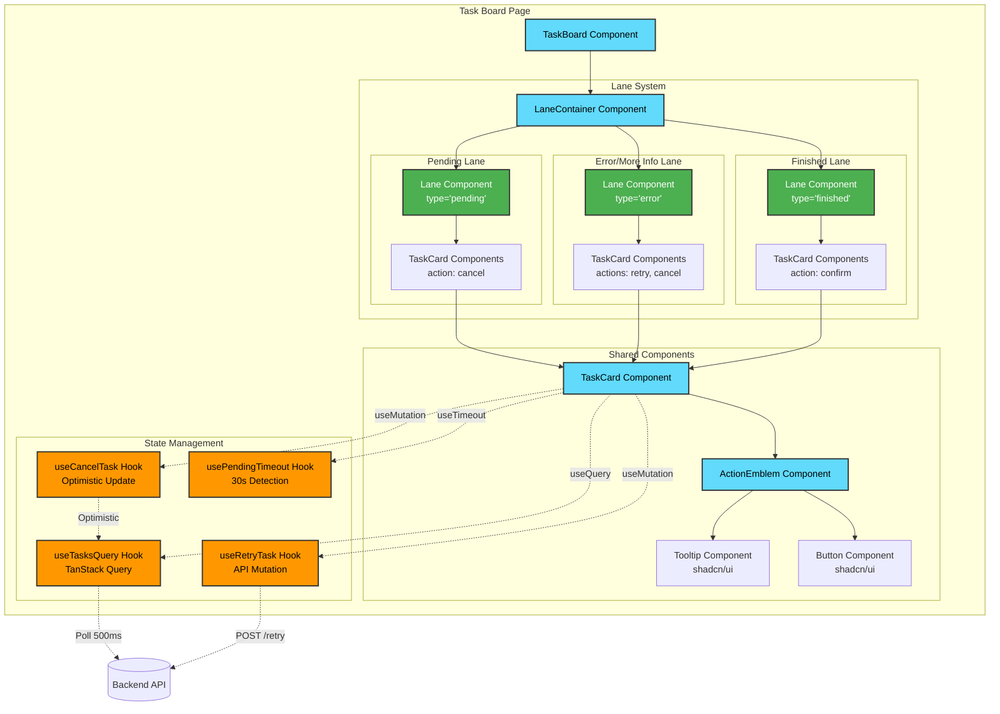
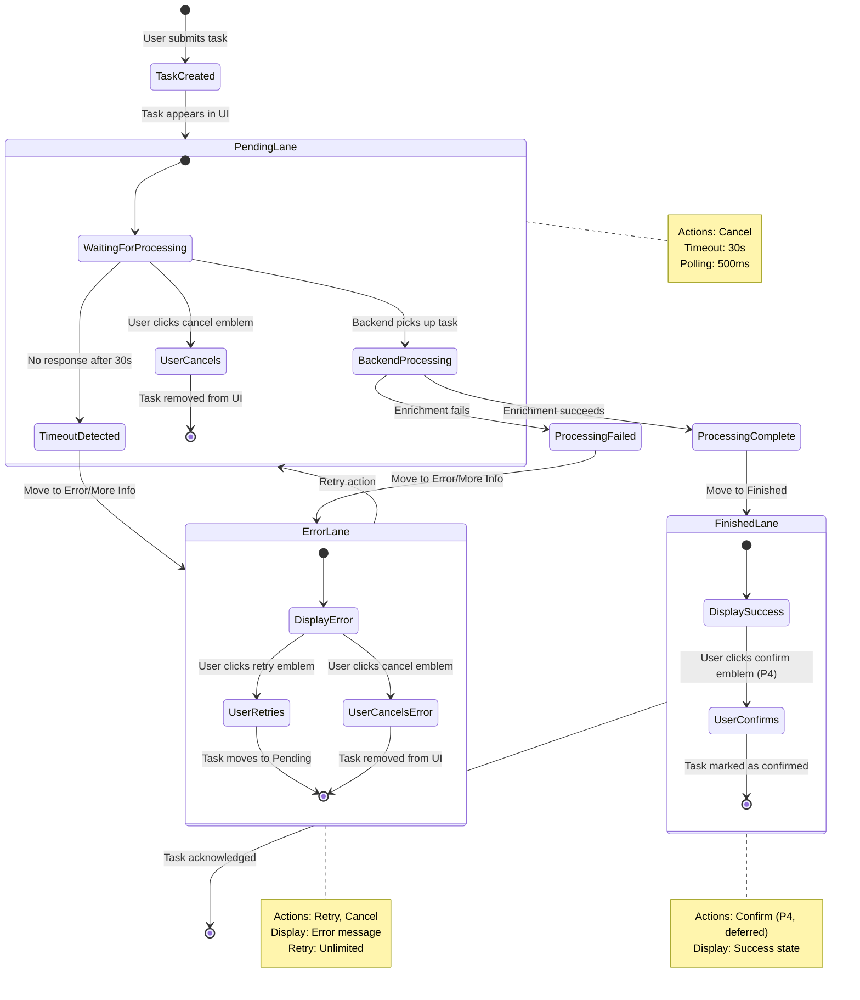
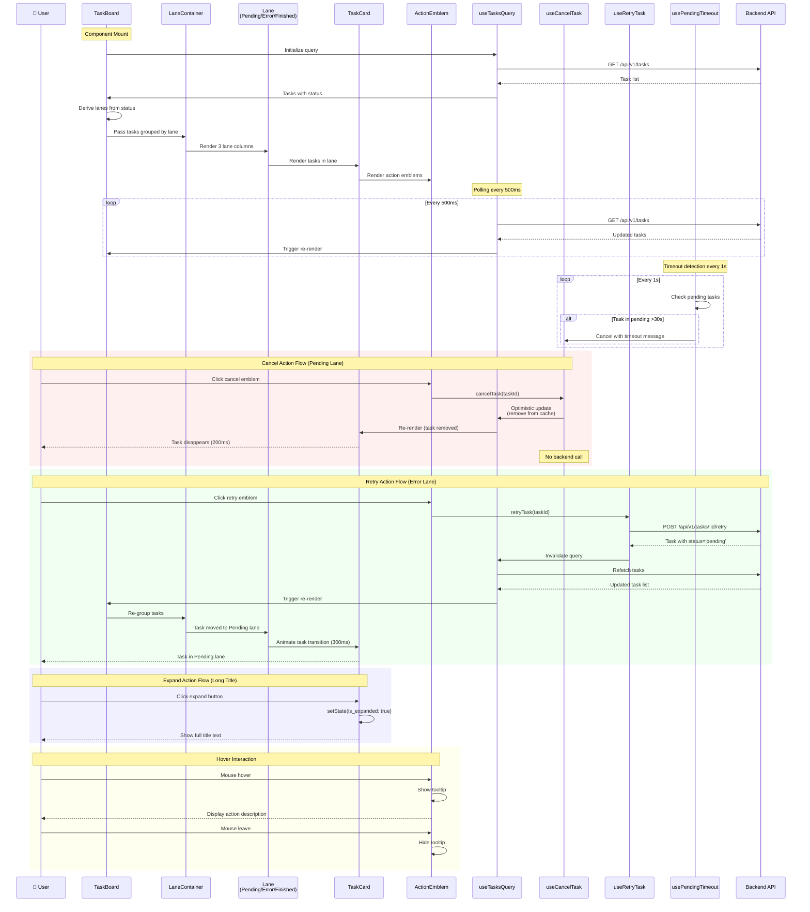

# Architecture Diagrams - Feature 003: Multi-Lane Task Workflow

This document provides visual representations of the component hierarchy, user flows, state management, and data flows for the multi-lane task workflow feature.

## Component Hierarchy Diagram



**Component Responsibilities:**

- **TaskBoard**: Root container, orchestrates polling and global state
- **LaneContainer**: 3-column layout manager with Framer Motion animations
- **Lane**: Renders tasks for a specific workflow stage, displays empty state
- **TaskCard**: Individual task display with title (truncated at 100 chars), timestamps, error messages
- **ActionEmblem**: Icon button with tooltip, handles click events (cancel/retry/confirm)
- **useTasksQuery**: TanStack Query hook, polls backend every 500ms, derives lane from task status
- **useCancelTask**: Optimistic mutation, removes task from cache immediately
- **useRetryTask**: API mutation, calls POST /tasks/:id/retry, refetches on success
- **usePendingTimeout**: Interval hook, detects tasks in pending lane for >30s, triggers error transition

---

## User Flow Diagram



**User Flow Stages:**

1. **Task Created**: User submits task via chat input (Feature 001)
2. **Pending Lane**: Task waits for backend processing
   - User can cancel (frontend-only, immediate)
   - Timeout detection after 30s → move to Error lane
3. **Processing**: Backend enriches task with LLM
   - Success → move to Finished lane
   - Failure → move to Error lane with error message
4. **Error/More Info Lane**: Task failed or requires attention
   - User can retry (re-submit to backend)
   - User can cancel (remove from UI)
   - Unlimited retry attempts
5. **Finished Lane**: Task completed successfully
   - User can confirm (P4, placeholder for now)

**Timing Information:**

- **Poll interval**: 500ms (TanStack Query)
- **Timeout detection**: 30 seconds in pending lane
- **Lane transition animation**: 300ms (Framer Motion)
- **Cancel action latency**: <200ms (optimistic update)
- **Retry action latency**: <500ms (API round-trip)

---

## State Management Diagram

```mermaid
graph TB
    subgraph "Backend State"
        BackendDB[(SQLite DB)]
        TaskStatus[Task Status Field<br/>pending/processing/completed/error/needs_info]
    end

    subgraph "TanStack Query Cache"
        QueryCache[Tasks Query Cache<br/>queryKey: ['tasks']]
        PollInterval[Poll every 500ms]
        OptimisticCache[Optimistic Updates<br/>Cancel action]
    end

    subgraph "Client-Side Computed State"
        LaneDerivation[Lane Derivation Logic<br/>pending/error/finished]
        ActionEmblems[Action Emblem Computation<br/>cancel/retry/confirm]
        TimeoutTracking[Timeout Tracking<br/>submitted_at timestamps]
    end

    subgraph "Component Local State"
        ExpandedState[TaskCard.is_expanded<br/>useState]
        HoverState[ActionEmblem.hover<br/>useState]
    end

    subgraph "Mutations"
        CancelMutation[useCancelTask<br/>Optimistic Update]
        RetryMutation[useRetryTask<br/>API Call]
    end

    BackendDB -->|Poll 500ms| QueryCache
    QueryCache -->|Transform| LaneDerivation
    LaneDerivation -->|Compute| ActionEmblems
    QueryCache -->|Track| TimeoutTracking

    ActionEmblems --> ExpandedState
    ActionEmblems --> HoverState

    CancelMutation -->|Remove from cache| QueryCache
    RetryMutation -->|POST /retry| BackendDB
    RetryMutation -->|Refetch| QueryCache

    TimeoutTracking -.->|After 30s| CancelMutation

    classDef backend fill:#009688,stroke:#333,stroke-width:2px,color:#fff
    classDef cache fill:#ff9800,stroke:#333,stroke-width:2px,color:#000
    classDef computed fill:#9c27b0,stroke:#333,stroke-width:2px,color:#fff
    classDef local fill:#61dafb,stroke:#333,stroke-width:2px,color:#000
    classDef mutation fill:#f44336,stroke:#333,stroke-width:2px,color:#fff

    class BackendDB,TaskStatus backend
    class QueryCache,PollInterval,OptimisticCache cache
    class LaneDerivation,ActionEmblems,TimeoutTracking computed
    class ExpandedState,HoverState local
    class CancelMutation,RetryMutation mutation
```

**State Management Strategy:**

### Server State (TanStack Query)
- **Query Key**: `['tasks']`
- **Polling**: 500ms interval (same as Feature 001)
- **Caching**: In-memory cache, invalidated on mutations
- **Optimistic Updates**: Cancel action updates cache immediately before server confirmation

### Computed State (Client-Side)
- **Lane Derivation**: Pure function mapping task status → lane
  ```typescript
  function getLane(task: Task): Lane {
    if (task.status === 'pending' || task.status === 'processing') return 'pending'
    if (task.status === 'error' || task.status === 'needs_info') return 'error'
    if (task.status === 'completed') return 'finished'
  }
  ```
- **Action Emblems**: Computed based on lane
  - Pending: `['cancel']`
  - Error: `['retry', 'cancel']`
  - Finished: `['confirm']` (P4, deferred)
- **Timeout Tracking**: `submitted_at` timestamp stored when task enters pending lane, checked every 1s

### Local Component State
- **TaskCard.is_expanded**: Boolean, controls truncated vs full text display
- **ActionEmblem.hover**: Boolean, triggers tooltip display
- **No persistent state**: All UI state resets on component unmount

### Mutations
- **Cancel**: Optimistic update → remove from cache → no backend call (frontend-only)
- **Retry**: Pessimistic update → POST /tasks/:id/retry → refetch on success

---

## Data Flow Between Components



**Data Flow Timing:**

1. **Initial Load**:
   - Component mount → Query init → API call → Render (500-1000ms)

2. **Polling Cycle**:
   - Every 500ms: Fetch tasks → Derive lanes → Group tasks → Re-render
   - Lane derivation: O(n) where n = task count, <10ms for <1000 tasks

3. **Cancel Action**:
   - User click → Optimistic update → UI update (<200ms)
   - No backend round-trip

4. **Retry Action**:
   - User click → API call → Response → Refetch → Re-render (<500ms)
   - Backend processing time: 5-30s (same as Feature 001)

5. **Timeout Detection**:
   - Every 1s: Check pending tasks → Trigger cancel if >30s
   - Moves task to Error lane with message "Backend unavailable - retry when online"

6. **Lane Transitions**:
   - Framer Motion animations: 300ms duration
   - Layout shift handled by AnimatePresence
   - Task cards fade out → reposition → fade in

**Animation Timings:**

- **Task card enter**: 300ms fade-in with slide (Framer Motion)
- **Task card exit**: 300ms fade-out with slide (Framer Motion)
- **Lane reflow**: 300ms stagger (sequential task animations)
- **Hover state**: 150ms transition (CSS)
- **Button press**: 100ms scale animation (CSS)

---

## Technology Stack Integration

### React 18 + TypeScript
- **Component Structure**: Functional components with hooks
- **Type Safety**: Full TypeScript coverage (strict mode enabled)
- **Memoization**: `useMemo` for lane grouping, `useCallback` for action handlers

### TanStack Query v5
- **Server State**: Manages tasks query with 500ms polling
- **Mutations**: Optimistic updates (cancel), pessimistic updates (retry)
- **Cache Management**: Automatic invalidation and refetching

### Framer Motion
- **Layout Animations**: `<motion.div layout>` for lane reflow
- **Exit Animations**: `<AnimatePresence>` for task removal
- **Variants**: Predefined animation variants for enter/exit
- **Performance**: GPU-accelerated transforms (translate/scale)

### shadcn/ui
- **Button**: ActionEmblem icons (X, RotateCw, Check)
- **Tooltip**: Hover explanations for emblems
- **Card**: TaskCard container with shadows and borders
- **Badge**: Status indicators (pending/error/finished)

### Existing Task Entity (Feature 001)
- **No schema changes**: Reuses existing `Task` type
- **Status mapping**: `pending/processing` → Pending lane
- **Status mapping**: `error/needs_info` → Error lane
- **Status mapping**: `completed` → Finished lane

---

## Performance Considerations

### Rendering Optimization
- **Virtualization**: NOT implemented (assumption: <100 tasks per lane)
- **Memoization**: Lane grouping memoized with `useMemo`
- **Key prop**: Stable task.id used for React reconciliation

### Network Optimization
- **Polling**: 500ms interval (same as Feature 001)
- **Debouncing**: Retry action debounced by 500ms (prevent double-click)
- **Optimistic Updates**: Cancel action avoids backend round-trip

### Animation Optimization
- **GPU Acceleration**: Framer Motion uses `transform` (not `left/top`)
- **Will-change**: Applied to animating task cards
- **Reduced Motion**: Respects `prefers-reduced-motion` media query

---

## Error Handling

### Network Errors
- **Query Failure**: Display error toast, retry query after 3s
- **Mutation Failure**: Rollback optimistic update, show error message
- **Timeout**: Automatically move to Error lane after 30s

### User Action Errors
- **Cancel in Processing State**: Move to Error lane with message "Cancellation failed - task already processing"
- **Retry Unavailable Backend**: Show error toast "Backend unavailable - try again later"
- **Multiple Rapid Clicks**: Debounce retry/cancel actions by 500ms

### Validation Errors
- **Invalid Task ID**: 404 from backend → show error toast "Task not found"
- **Malformed Response**: Parsing error → log to console, display fallback UI

---

## Configuration

### Environment Variables (Frontend)
```typescript
VITE_API_BASE_URL=http://localhost:8000/api/v1
VITE_POLLING_INTERVAL=500  // milliseconds
VITE_PENDING_TIMEOUT=30000  // milliseconds (30s)
VITE_LANE_TRANSITION_DURATION=300  // milliseconds
VITE_TITLE_TRUNCATE_LENGTH=100  // characters
```

### Constants
```typescript
const POLL_INTERVAL = 500  // TanStack Query polling
const TIMEOUT_CHECK_INTERVAL = 1000  // Timeout detection interval
const PENDING_TIMEOUT = 30000  // 30 seconds
const TRANSITION_DURATION = 300  // Framer Motion duration
const TITLE_TRUNCATE_LENGTH = 100  // Character limit
```

---

## Testing Strategy

### Component Tests (Vitest + Testing Library)
- **Lane Rendering**: Verify 3 lanes display with correct tasks
- **Action Emblems**: Verify correct emblems per lane
- **Truncation**: Verify >100 char titles show ellipsis + expand
- **Animations**: Verify Framer Motion variants applied

### Integration Tests
- **Cancel Flow**: Click cancel → verify task removed from UI
- **Retry Flow**: Click retry → verify API call → verify task moves to Pending
- **Timeout Flow**: Mock 30s delay → verify task moves to Error lane
- **Lane Transitions**: Create task → verify appears in Pending → mock success → verify moves to Finished

### E2E Tests (Playwright)
- **Full User Journey**: Create task → cancel in pending → verify removed
- **Retry Journey**: Force error → click retry → verify task succeeds
- **Timeout Journey**: Disconnect backend → wait 30s → verify timeout message

---

## Deployment Notes

### Build Artifacts
- **Frontend**: Static assets (HTML/CSS/JS) served by Vite dev server (dev) or nginx (prod)
- **No backend changes**: Reuses existing FastAPI endpoints from Feature 001
- **New endpoint**: POST /api/v1/tasks/:id/retry (backend implementation required)

### Container Updates
- **Frontend container**: No Dockerfile changes, install Framer Motion package
- **Backend container**: Add retry endpoint, no database migrations

### Rollout Strategy
1. Deploy backend retry endpoint (backward compatible, no breaking changes)
2. Deploy frontend with new lane UI (graceful degradation if retry endpoint missing)
3. Monitor error rates and timeout frequency
4. Adjust timeout threshold if needed (30s default may be too aggressive)

---

## Future Enhancements (Out of Scope)

- **Drag-and-Drop**: Move tasks between lanes manually (Feature 005)
- **Lane Filtering**: Hide/show lanes, search within lanes (Feature 007)
- **Bulk Actions**: Multi-select tasks, cancel/retry all (Feature 006)
- **Custom Lanes**: User-defined workflow stages (Feature 004)
- **Undo Cancel**: Restore canceled tasks from local cache
- **Lane Persistence**: Remember lane collapse/expand state in localStorage
- **Task Prioritization**: Sort tasks by priority within lanes (not just chronological)
