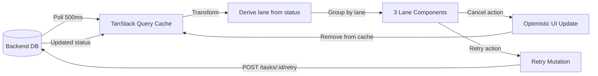

# Data Model: Multi-Lane Task Workflow with Action Emblems

**Feature**: 003-task-lane-workflow
**Created**: 2025-11-05
**Purpose**: Define data structures for lane-based task workflow

## Overview

This feature does NOT introduce new database entities. It extends the existing Task entity (from Feature 001) with client-side computed fields for lane assignment. All lane logic is derived from existing task `status` field.

**Key principle**: No database schema changes required. All lane-related state is computed on the client from existing `Task.status` values.

## Entity Extensions

### Task (Extended from Feature 001)

**Existing fields** (unchanged, from Feature 001):
- `id`: string (UUID) - Unique task identifier
- `title`: string - Task title/description
- `status`: enum(`'pending'`, `'processing'`, `'completed'`, `'error'`, `'needs_info'`) - Task processing status
- `created_at`: ISO timestamp - Task creation time
- `updated_at`: ISO timestamp - Last status update time
- `enriched_title`: string (optional) - LLM-enhanced title
- `error_message`: string (optional) - Error details if status='error'

**New computed fields** (client-side only, not persisted):
- `lane`: enum(`'pending'`, `'error'`, `'finished'`) - Derived from status field
- `action_emblems`: string[] - Available actions based on lane (e.g., `['cancel']` for pending)
- `is_expanded`: boolean - UI state for expanded task card (local component state)
- `submitted_at`: ISO timestamp - When task entered pending lane (for timeout detection)

**Lane derivation logic**:
```typescript
function getLane(task: Task): Lane {
  if (task.status === 'pending' || task.status === 'processing') {
    return 'pending'
  }
  if (task.status === 'error' || task.status === 'needs_info') {
    return 'error'
  }
  if (task.status === 'completed') {
    return 'finished'
  }
}
```

**Action emblems by lane**:
- Pending lane: `['cancel']`
- Error lane: `['retry', 'cancel']`
- Finished lane: `['confirm']` (P4, deferred implementation)

## TypeScript Interfaces

### TaskWithLane

```typescript
interface TaskWithLane extends Task {
  // Computed fields
  lane: 'pending' | 'error' | 'finished'
  action_emblems: ActionEmblem[]

  // Optional client state
  submitted_at?: string  // ISO timestamp for timeout detection
  is_expanded?: boolean   // UI expansion state
}
```

### ActionEmblem

```typescript
type ActionEmblem = 'cancel' | 'retry' | 'confirm' | 'expand'

interface ActionEmblemConfig {
  type: ActionEmblem
  icon: IconComponent
  tooltip: string
  onClick: (taskId: string) => void
  variant?: 'default' | 'ghost' | 'destructive'
}
```

### LaneConfig

```typescript
interface LaneConfig {
  id: 'pending' | 'error' | 'finished'
  title: string
  description?: string
  emptyMessage: string
  taskStatuses: TaskStatus[]  // Which statuses map to this lane
}

const LANE_CONFIGS: LaneConfig[] = [
  {
    id: 'pending',
    title: 'Pending',
    description: 'Tasks waiting for processing',
    emptyMessage: 'No pending tasks',
    taskStatuses: ['pending', 'processing']
  },
  {
    id: 'error',
    title: 'Error / More Info',
    description: 'Tasks requiring attention',
    emptyMessage: 'No errors or information requests',
    taskStatuses: ['error', 'needs_info']
  },
  {
    id: 'finished',
    title: 'Finished',
    description: 'Completed tasks',
    emptyMessage: 'No finished tasks yet',
    taskStatuses: ['completed']
  }
]
```

## State Management

### Client-Side State

All lane-related state is derived or local:
- **Lane assignment**: Computed from `task.status` (no separate state)
- **Timeout tracking**: Local timestamps in `submitted_at` field
- **Expansion state**: Local component state (`useState` in TaskCard)

### Server State (via TanStack Query)

- **Tasks query**: `useQuery({ queryKey: ['tasks'], ... })` (existing from Feature 001)
- **Optimistic cancel**: `useMutation` with optimistic update pattern
- **Retry mutation**: `useMutation({ mutationFn: retryTask })` (new)

## Data Flow



## Validation Rules

### Task Card Display

- Title truncation: If `title.length > 100`, show ellipsis + expand button
- Error message: Required if `lane === 'error'`, display prominently
- Timestamp display: Show `updated_at` in relative format (e.g., "2 minutes ago")

### Action Availability

- Cancel emblem: Available in 'pending' and 'error' lanes only
- Retry emblem: Available in 'error' lane only
- Confirm emblem: Available in 'finished' lane only (P4, deferred)
- Expand emblem: Available if `title.length > 100`

### Timeout Detection

- Track `submitted_at` timestamp when task enters pending lane
- Every 1 second, check if `Date.now() - submitted_at > 30000`
- If timeout detected AND `status === 'pending'`, trigger transition to error lane

## No Database Changes Required

This feature requires NO database schema changes or migrations. All data derives from existing Task table fields from Feature 001.

**Backend changes needed**:
- One new endpoint: `POST /api/tasks/:id/retry` (re-submit task for processing)
- No database table changes
- No new database fields

## API Contract

### New Endpoint: Retry Task

**Request**:
```
POST /api/tasks/:id/retry
```

**Response** (200 OK):
```json
{
  "id": "uuid",
  "title": "string",
  "status": "pending",
  "created_at": "ISO timestamp",
  "updated_at": "ISO timestamp",
  "enriched_title": "string (optional)",
  "error_message": null
}
```

**Error responses**:
- 404: Task not found
- 400: Task not in retryable state (e.g., already pending)

**Behavior**:
- Clears `error_message` field
- Sets `status` to 'pending'
- Updates `updated_at` timestamp
- Re-enqueues task for processing (same as new task submission)

## Implementation Notes

### Frontend State Derivation

Tasks are fetched via existing TanStack Query `useQuery(['tasks'])` hook. Client-side transformations:

1. **Lane assignment**: Apply `getLane()` function to each task
2. **Action emblem computation**: Map lane to available actions
3. **Timeout tracking**: Store `submitted_at` in local state when task first appears in pending lane
4. **Grouping**: Group tasks by lane for column rendering

### Optimistic Updates

For cancel action:
```typescript
const cancelTask = useMutation({
  mutationFn: (taskId: string) => api.delete(`/tasks/${taskId}`),
  onMutate: async (taskId) => {
    // Optimistically remove from cache
    await queryClient.cancelQueries(['tasks'])
    const previous = queryClient.getQueryData(['tasks'])
    queryClient.setQueryData(['tasks'], (old) =>
      old.filter(task => task.id !== taskId)
    )
    return { previous }
  },
  onError: (err, taskId, context) => {
    // Rollback on error
    queryClient.setQueryData(['tasks'], context.previous)
  }
})
```

### Performance Considerations

- **Polling frequency**: 500ms (same as Feature 001)
- **Lane recomputation**: O(n) on each poll, acceptable for <1000 tasks
- **Timeout checks**: Run every 1s via `setInterval` in `usePendingTimeout` hook
- **Optimistic updates**: Prevent UI lag on cancel action

## Future Extensions (Out of Scope for Feature 003)

- **Custom lanes**: User-configurable lane definitions (Feature 004)
- **Lane transitions**: Drag-and-drop between lanes (Feature 005)
- **Bulk actions**: Multi-select + bulk cancel/retry (Feature 006)
- **Lane filtering**: Hide/show lanes, search within lanes (Feature 007)

## Related Documents

- `/specs/003-task-lane-workflow/spec.md` - Full feature specification
- `/specs/003-task-lane-workflow/plan.md` - Implementation plan
- `/specs/001-chat-task-entry/data-model.md` - Base Task entity (Feature 001)
