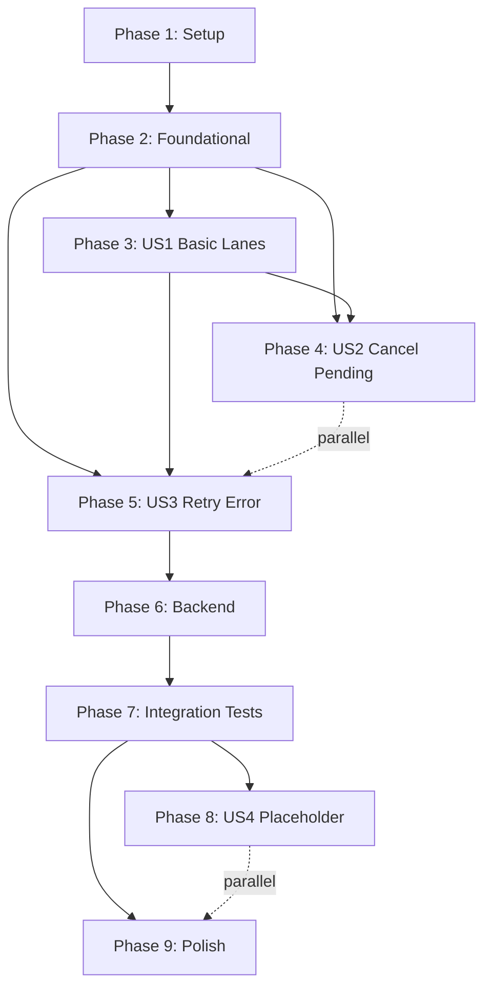
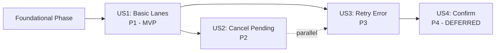

# Tasks: Multi-Lane Task Workflow with Action Emblems

**Input**: Design documents from `/specs/003-task-lane-workflow/`
**Prerequisites**: plan.md (✅), spec.md (✅), research.md (✅), data-model.md (✅), architecture.md (✅), contracts/ (✅)

**Tests**: TDD is **NON-NEGOTIABLE** per constitution. Every task follows strict RED-GREEN-REFACTOR cycle.

**Organization**: Tasks are grouped by user story to enable independent implementation and testing of each story.

## Format: `[ID] [P?] [Story] Description`

- **[P]**: Can run in parallel (different files, no dependencies)
- **[Story]**: Which user story this task belongs to (e.g., US1, US2, US3)
- Include exact file paths in descriptions

## Path Conventions

- **Web app**: `backend/src/`, `frontend/src/`
- All paths shown below follow existing project structure from Feature 001

---

## Phase 1: Setup (Shared Infrastructure)

**Purpose**: Project initialization and basic structure for lane workflow feature

- [X] T001 Install framer-motion dependency in frontend/package.json (^10.0.0)
- [X] T002 [P] Create directory structure frontend/src/components/LaneWorkflow/
- [X] T003 [P] Create directory structure frontend/src/hooks/ (if not exists)
- [X] T004 [P] Create directory structure frontend/tests/e2e/ (if not exists)
- [X] T005 [P] Create TypeScript types file frontend/src/types/task.ts for TaskWithLane interface
- [X] T006 [P] Configure Playwright E2E test environment in frontend/playwright.config.ts (if not exists)
- [X] T007 [P] Create test directory frontend/src/components/LaneWorkflow/__tests__/
- [X] T008 [P] Create test directory frontend/src/hooks/__tests__/

---

## Phase 2: Foundational (Blocking Prerequisites)

**Purpose**: Core infrastructure that MUST be complete before ANY user story can be implemented

**⚠️ CRITICAL**: No user story work can begin until this phase is complete

### Types and Constants

- [X] T009 Define TaskWithLane interface extending Task in frontend/src/types/task.ts
- [X] T010 [P] Define LaneType union type ('pending' | 'error' | 'finished') in frontend/src/types/task.ts
- [X] T011 [P] Define ActionEmblemType union type ('cancel' | 'retry' | 'confirm' | 'expand') in frontend/src/types/task.ts
- [X] T012 Create LANE_CONFIGS constant in frontend/src/lib/laneConfigs.ts with lane metadata (labels, colors, order)
- [X] T013 [P] Create ACTION_EMBLEM_CONFIGS constant in frontend/src/lib/actionEmblemConfigs.ts with emblem metadata (icons, tooltips, colors)

### API Client Extension

- [X] T014 Add retry method to taskApi service in frontend/src/services/taskApi.ts for POST /api/tasks/:id/retry

### Base Hook Infrastructure

- [X] T015 Create empty useLaneWorkflow.ts hook file in frontend/src/hooks/useLaneWorkflow.ts
- [X] T016 [P] Create empty useTaskActions.ts hook file in frontend/src/hooks/useTaskActions.ts
- [X] T017 [P] Create empty useTimeoutDetection.ts hook file in frontend/src/hooks/useTimeoutDetection.ts

**Checkpoint**: Foundation ready - user story implementation can now begin in parallel

---

## Phase 3: User Story 1 - Basic Lane Visualization (Priority: P1) 🎯 MVP

**Goal**: Display tasks in three lanes (Pending, Error/More Info, Finished) with automatic movement based on status

**Independent Test**: Create a task and observe it appear in Pending lane, then trigger different outcomes to see tasks move to Error/More Info or Finished lanes

### RED Phase - Write Failing Tests First (US1)

- [X] T018 [P] [US1] Write test: LaneWorkflow renders three lanes with correct labels in frontend/src/components/LaneWorkflow/__tests__/LaneWorkflow.test.tsx
- [X] T019 [P] [US1] Write test: Lane component displays tasks passed as props in frontend/src/components/LaneWorkflow/__tests__/Lane.test.tsx
- [X] T020 [P] [US1] Write test: TaskCard renders task title and status in frontend/src/components/LaneWorkflow/__tests__/TaskCard.test.tsx
- [X] T021 [P] [US1] Write test: useLaneWorkflow hook derives lanes from task status in frontend/src/hooks/__tests__/useLaneWorkflow.test.ts
- [X] T022 [P] [US1] Write test: Tasks with status 'pending' appear in Pending lane in frontend/src/hooks/__tests__/useLaneWorkflow.test.ts
- [X] T023 [P] [US1] Write test: Tasks with status 'error' appear in Error/More Info lane in frontend/src/hooks/__tests__/useLaneWorkflow.test.ts
- [X] T024 [P] [US1] Write test: Tasks with status 'completed' appear in Finished lane in frontend/src/hooks/__tests__/useLaneWorkflow.test.ts
- [X] T025 [P] [US1] Write test: Tasks within each lane ordered chronologically (newest first) in frontend/src/hooks/__tests__/useLaneWorkflow.test.ts
- [X] T026 [P] [US1] Write test: LaneWorkflow uses CSS Grid layout for three columns in frontend/src/components/LaneWorkflow/__tests__/LaneWorkflow.test.tsx

**Verify**: Run tests with `npm test` - ALL tests should FAIL (RED phase complete)

### GREEN Phase - Minimal Implementation (US1)

- [X] T027 [US1] Implement LaneWorkflow component with CSS Grid layout in frontend/src/components/LaneWorkflow/LaneWorkflow.tsx
- [X] T028 [US1] Implement Lane component with basic task list rendering in frontend/src/components/LaneWorkflow/Lane.tsx
- [X] T029 [US1] Implement TaskCard component with basic task display (no emblems yet) in frontend/src/components/LaneWorkflow/TaskCard.tsx
- [X] T030 [US1] Implement useLaneWorkflow hook with lane derivation logic in frontend/src/hooks/useLaneWorkflow.ts
- [X] T031 [US1] Add chronological sorting (newest first) to useLaneWorkflow hook in frontend/src/hooks/useLaneWorkflow.ts
- [X] T032 [US1] Wire up LaneWorkflow in TasksPage.tsx to replace TaskList component in frontend/src/pages/TasksPage.tsx
- [X] T033 [US1] Add Framer Motion AnimatePresence wrapper to LaneWorkflow in frontend/src/components/LaneWorkflow/LaneWorkflow.tsx
- [X] T034 [US1] Add Framer Motion layout animation to TaskCard in frontend/src/components/LaneWorkflow/TaskCard.tsx
- [X] T035 [US1] Create index.ts barrel export for LaneWorkflow components in frontend/src/components/LaneWorkflow/index.ts

**Verify**: Run tests with `npm test` - ALL tests should PASS (GREEN phase complete)

### REFACTOR Phase - Optimize and Extract (US1)

- [X] T036 [US1] Extract LaneHeader subcomponent from Lane component in frontend/src/components/LaneWorkflow/LaneHeader.tsx
- [X] T037 [US1] Apply React.memo to TaskCard component for render optimization in frontend/src/components/LaneWorkflow/TaskCard.tsx
- [X] T038 [US1] Apply React.memo to Lane component for render optimization in frontend/src/components/LaneWorkflow/Lane.tsx
- [X] T039 [US1] Extract useLaneTransition animation hook from LaneWorkflow in frontend/src/hooks/useLaneTransition.ts
- [X] T040 [US1] Optimize Framer Motion animation performance (target <300ms) in frontend/src/components/LaneWorkflow/TaskCard.tsx
- [X] T041 [US1] Add ARIA labels for accessibility to Lane component in frontend/src/components/LaneWorkflow/Lane.tsx
- [X] T042 [US1] Add ARIA labels for accessibility to LaneWorkflow component in frontend/src/components/LaneWorkflow/LaneWorkflow.tsx

**Checkpoint**: User Story 1 complete and independently testable. Users can now visualize tasks in lanes.

---

## Phase 4: User Story 2 - Cancel Action in Pending Lane (Priority: P2)

**Goal**: Allow users to cancel tasks in Pending lane with immediate UI removal (frontend-only)

**Independent Test**: Create a task in Pending lane, click cancel emblem, verify task disappears from UI

### RED Phase - Write Failing Tests First (US2)

- [X] T043 [P] [US2] Write test: ActionEmblem component renders button with icon in frontend/src/components/LaneWorkflow/__tests__/ActionEmblem.test.tsx
- [X] T044 [P] [US2] Write test: ActionEmblem shows tooltip on hover in frontend/src/components/LaneWorkflow/__tests__/ActionEmblem.test.tsx
- [X] T045 [P] [US2] Write test: ActionEmblem calls onClick handler when clicked in frontend/src/components/LaneWorkflow/__tests__/ActionEmblem.test.tsx
- [X] T046 [P] [US2] Write test: Cancel emblem appears in TaskCard when lane is 'pending' in frontend/src/components/LaneWorkflow/__tests__/TaskCard.test.tsx
- [X] T047 [P] [US2] Write test: Cancel emblem does NOT appear in TaskCard when lane is 'error' or 'finished' in frontend/src/components/LaneWorkflow/__tests__/TaskCard.test.tsx
- [X] T048 [P] [US2] Write test: useTaskActions hook has cancel mutation in frontend/src/hooks/__tests__/useTaskActions.test.ts
- [X] T049 [P] [US2] Write test: Cancel mutation performs optimistic update (removes task from UI) in frontend/src/hooks/__tests__/useTaskActions.test.ts
- [X] T050 [P] [US2] Write test: Cancel mutation does NOT call backend API in frontend/src/hooks/__tests__/useTaskActions.test.ts
- [X] T051 [P] [US2] Write test: Clicking cancel emblem removes task from Pending lane in frontend/src/components/LaneWorkflow/__tests__/LaneWorkflow.test.tsx

**Verify**: Run tests with `npm test` - NEW tests should FAIL (RED phase complete)

### GREEN Phase - Minimal Implementation (US2)

- [X] T052 [US2] Implement ActionEmblem component with Button and Tooltip in frontend/src/components/LaneWorkflow/ActionEmblem.tsx
- [X] T053 [US2] Add cancel emblem rendering to TaskCard (Pending lane only) in frontend/src/components/LaneWorkflow/TaskCard.tsx
- [X] T054 [US2] Implement useTaskActions hook with cancel mutation using TanStack Query in frontend/src/hooks/useTaskActions.ts
- [X] T055 [US2] Configure optimistic update in cancel mutation (remove from cache) in frontend/src/hooks/useTaskActions.ts
- [X] T056 [US2] Wire up cancel emblem onClick to useTaskActions.cancel in TaskCard in frontend/src/components/LaneWorkflow/TaskCard.tsx
- [X] T057 [US2] Add Framer Motion exit animation to TaskCard when removed in frontend/src/components/LaneWorkflow/TaskCard.tsx
- [X] T058 [US2] Configure AnimatePresence in Lane component to handle task removal in frontend/src/components/LaneWorkflow/Lane.tsx

**Verify**: Run tests with `npm test` - ALL tests should PASS (GREEN phase complete)

### REFACTOR Phase - Optimize and Extract (US2)

- [X] T059 [US2] Extract getEmblemsForLane utility function in frontend/src/lib/emblemUtils.ts
- [X] T060 [US2] Extract useEmblemVisibility hook from TaskCard in frontend/src/hooks/useEmblemVisibility.ts
- [X] T061 [US2] Optimize cancel animation performance (target <200ms) in frontend/src/components/LaneWorkflow/TaskCard.tsx
- [X] T062 [US2] Add error boundary for cancel action failures in frontend/src/components/LaneWorkflow/TaskCard.tsx

**Checkpoint**: User Story 2 complete. Users can now cancel tasks in Pending lane.

---

## Phase 5: User Story 3 - Retry and Cancel in Error Lane (Priority: P3)

**Goal**: Allow users to retry failed tasks or cancel them from Error/More Info lane

**Independent Test**: Force a task to fail, verify it appears in Error lane with retry and cancel emblems, test both actions

### RED Phase - Write Failing Tests First (US3)

- [X] T063 [P] [US3] Write test: Retry emblem appears in TaskCard when lane is 'error' in frontend/src/components/LaneWorkflow/__tests__/TaskCard.test.tsx
- [X] T064 [P] [US3] Write test: Cancel emblem appears in TaskCard when lane is 'error' in frontend/src/components/LaneWorkflow/__tests__/TaskCard.test.tsx
- [X] T065 [P] [US3] Write test: Error message displays in TaskCard when lane is 'error' in frontend/src/components/LaneWorkflow/__tests__/TaskCard.test.tsx
- [X] T066 [P] [US3] Write test: useTaskActions hook has retry mutation in frontend/src/hooks/__tests__/useTaskActions.test.ts
- [X] T067 [P] [US3] Write test: Retry mutation calls taskApi.retry(taskId) in frontend/src/hooks/__tests__/useTaskActions.test.ts
- [X] T068 [P] [US3] Write test: Retry mutation moves task to Pending lane in frontend/src/hooks/__tests__/useTaskActions.test.ts
- [X] T069 [P] [US3] Write test: useTimeoutDetection triggers after 30 seconds with no response in frontend/src/hooks/__tests__/useTimeoutDetection.test.ts
- [X] T070 [P] [US3] Write test: useTimeoutDetection moves task to Error lane with "Backend unavailable" message in frontend/src/hooks/__tests__/useTimeoutDetection.test.ts
- [X] T071 [P] [US3] Write test: Clicking retry emblem moves task from Error to Pending lane in frontend/src/components/LaneWorkflow/__tests__/LaneWorkflow.test.tsx
- [X] T072 [P] [US3] Write test: Clicking cancel emblem in Error lane removes task from UI in frontend/src/components/LaneWorkflow/__tests__/LaneWorkflow.test.tsx

**Verify**: Run tests with `npm test` - NEW tests should FAIL (RED phase complete)

### GREEN Phase - Minimal Implementation (US3)

- [X] T073 [US3] Add retry emblem rendering to TaskCard (Error lane only) in frontend/src/components/LaneWorkflow/TaskCard.tsx
- [X] T074 [US3] Add cancel emblem rendering to TaskCard (Error lane only) in frontend/src/components/LaneWorkflow/TaskCard.tsx
- [X] T075 [US3] Add error message display to TaskCard (Error lane only) in frontend/src/components/LaneWorkflow/TaskCard.tsx
- [X] T076 [US3] Implement retry mutation in useTaskActions hook in frontend/src/hooks/useTaskActions.ts
- [X] T077 [US3] Wire up retry emblem onClick to useTaskActions.retry in TaskCard in frontend/src/components/LaneWorkflow/TaskCard.tsx
- [X] T078 [US3] Implement useTimeoutDetection hook with 30-second timer in frontend/src/hooks/useTimeoutDetection.ts
- [X] T079 [US3] Wire up useTimeoutDetection to move tasks to Error lane in LaneWorkflow in frontend/src/components/LaneWorkflow/LaneWorkflow.tsx
- [X] T080 [US3] Configure retry mutation to update task status to 'pending' in frontend/src/hooks/useTaskActions.ts

**Verify**: Run tests with `npm test` - ALL tests should PASS (GREEN phase complete)

### REFACTOR Phase - Optimize and Extract (US3)

- [X] T081 [US3] Extract ErrorMessage subcomponent from TaskCard in frontend/src/components/LaneWorkflow/ErrorMessage.tsx
- [X] T082 [US3] Extract timeout detection logic to separate utility in frontend/src/lib/timeoutUtils.ts
- [X] T083 [US3] Optimize timeout detection to avoid memory leaks on unmount in frontend/src/hooks/useTimeoutDetection.ts
- [X] T084 [US3] Add retry count tracking to TaskCard (display "Retry attempt #N") in frontend/src/components/LaneWorkflow/TaskCard.tsx
- [X] T085 [US3] Optimize polling integration to avoid conflicts with mutations in frontend/src/hooks/useTaskActions.ts

**Checkpoint**: User Story 3 complete. Users can now retry or cancel tasks in Error lane.

---

## Phase 6: Backend Integration (US3 Backend Support)

**Purpose**: Implement backend retry endpoint to support User Story 3

### RED Phase - Write Failing Backend Tests First

- [X] T086 [P] [US3] Write contract test: POST /api/tasks/:id/retry returns 200 with task in backend/tests/contract/test_task_api.py
- [X] T087 [P] [US3] Write contract test: POST /api/tasks/:id/retry returns 404 for non-existent task in backend/tests/contract/test_task_api.py
- [X] T088 [P] [US3] Write integration test: Retry endpoint re-enqueues task to enrichment queue in backend/tests/integration/test_task_retry.py
- [X] T089 [P] [US3] Write integration test: Retry endpoint resets task status to 'pending' in backend/tests/integration/test_task_retry.py
- [X] T090 [P] [US3] Write integration test: Retry endpoint is idempotent (multiple retries safe) in backend/tests/integration/test_task_retry.py

**Verify**: Run backend tests with `pytest` - NEW tests should FAIL (RED phase complete)

### GREEN Phase - Minimal Backend Implementation

- [X] T091 [US3] Implement POST /api/tasks/:id/retry endpoint in backend/src/api/tasks.py
- [X] T092 [US3] Add retry logic to re-enqueue task to enrichment queue in backend/src/api/tasks.py
- [X] T093 [US3] Add retry logic to reset task status to 'pending' in backend/src/api/tasks.py
- [X] T094 [US3] Add error handling for non-existent task (404 response) in backend/src/api/tasks.py
- [X] T095 [US3] Add idempotency check to retry endpoint in backend/src/api/tasks.py

**Verify**: Run backend tests with `pytest` - ALL tests should PASS (GREEN phase complete)

### REFACTOR Phase - Optimize Backend Code

- [X] T096 [US3] Extract retry logic to TaskService.retry_task method in backend/src/services/task_service.py
- [X] T097 [US3] Add logging for retry operations in backend/src/api/tasks.py
- [X] T098 [US3] Add retry endpoint to OpenAPI documentation in backend/src/api/tasks.py

---

## Phase 7: Integration & E2E Tests

**Purpose**: Validate complete user flows across frontend and backend

### Integration Tests (Frontend-Backend)

- [ ] T099 [P] Write integration test: Full lane workflow (create → pending → error → retry → finished) in frontend/tests/integration/lane-workflow-integration.test.ts
- [ ] T100 [P] Write integration test: Timeout detection moves task to Error lane after 30s in frontend/tests/integration/timeout-detection.test.ts
- [ ] T101 [P] Write integration test: Polling updates task status after backend changes in frontend/tests/integration/polling-integration.test.ts
- [ ] T102 [P] Write integration test: Cancel in Pending lane works with polling in frontend/tests/integration/cancel-pending-integration.test.ts
- [ ] T103 [P] Write integration test: Retry mutation invalidates TanStack Query cache correctly in frontend/tests/integration/retry-cache-integration.test.ts

### E2E Tests (Full User Journeys)

- [ ] T104 [P] Write E2E test: User creates task → sees in Pending → task completes → sees in Finished in frontend/tests/e2e/lane-workflow.spec.ts
- [ ] T105 [P] Write E2E test: User creates task → clicks cancel in Pending → task disappears in frontend/tests/e2e/cancel-pending.spec.ts
- [ ] T106 [P] Write E2E test: User creates task → task fails → sees in Error lane → clicks retry → task succeeds in frontend/tests/e2e/retry-workflow.spec.ts
- [ ] T107 [P] Write E2E test: User creates task → backend unavailable → timeout after 30s → task moves to Error lane in frontend/tests/e2e/timeout-scenario.spec.ts
- [ ] T108 [P] Write E2E test: User clicks retry → task fails again → sees updated error message in frontend/tests/e2e/retry-failure.spec.ts
- [ ] T109 [P] Write E2E test: User clicks cancel in Error lane → task disappears in frontend/tests/e2e/cancel-error.spec.ts

### Performance Validation Tests

- [ ] T110 [P] Write E2E test: Lane transition animation completes in <300ms in frontend/tests/e2e/animation-performance.spec.ts
- [ ] T111 [P] Write E2E test: Cancel action responds in <200ms in frontend/tests/e2e/cancel-performance.spec.ts
- [ ] T112 [P] Write E2E test: Retry action responds in <500ms in frontend/tests/e2e/retry-performance.spec.ts
- [ ] T113 [P] Write E2E test: UI remains responsive with 100 tasks per lane in frontend/tests/e2e/large-dataset-performance.spec.ts

---

## Phase 8: User Story 4 - Confirm Action Placeholder (Priority: P4) 🚧 DEFERRED

**Goal**: Add placeholder confirm emblem in Finished lane (no functionality in this iteration)

**Independent Test**: Create completed task, verify confirm emblem appears but does nothing when clicked

### Placeholder Implementation (US4)

- [ ] T114 [P] [US4] Write test: Confirm emblem appears in TaskCard when lane is 'finished' in frontend/src/components/LaneWorkflow/__tests__/TaskCard.test.tsx
- [ ] T115 [P] [US4] Write test: Confirm emblem shows tooltip "Coming soon" in frontend/src/components/LaneWorkflow/__tests__/ActionEmblem.test.tsx
- [ ] T116 [US4] Add confirm emblem rendering to TaskCard (Finished lane only) in frontend/src/components/LaneWorkflow/TaskCard.tsx
- [ ] T117 [US4] Wire up confirm emblem onClick to no-op handler (placeholder) in frontend/src/components/LaneWorkflow/TaskCard.tsx
- [ ] T118 [US4] Add "Coming soon" tooltip to confirm emblem in frontend/src/lib/actionEmblemConfigs.ts

**Checkpoint**: User Story 4 placeholder complete. Confirm emblem visible but non-functional.

---

## Phase 9: Polish & Cross-Cutting Concerns

**Purpose**: Improvements that affect multiple user stories

### Text Truncation and Expand/Collapse

- [ ] T119 [P] Implement text truncation (100 char limit) with CSS line-clamp in TaskCard in frontend/src/components/LaneWorkflow/TaskCard.tsx
- [ ] T120 [P] Add expand/collapse emblem to truncated task descriptions in frontend/src/components/LaneWorkflow/TaskCard.tsx
- [ ] T121 [P] Write test: Expand emblem shows full text when clicked in frontend/src/components/LaneWorkflow/__tests__/TaskCard.test.tsx
- [ ] T122 [P] Write test: Collapse emblem truncates text when clicked in frontend/src/components/LaneWorkflow/__tests__/TaskCard.test.tsx

### Tooltip Refinements

- [ ] T123 [P] Ensure all action emblems have consistent tooltip styling in frontend/src/components/LaneWorkflow/ActionEmblem.tsx
- [ ] T124 [P] Add keyboard navigation support to tooltips (Escape to close) in frontend/src/components/LaneWorkflow/ActionEmblem.tsx
- [ ] T125 [P] Optimize tooltip rendering performance (delay 500ms) in frontend/src/components/LaneWorkflow/ActionEmblem.tsx

### Animation Tuning

- [ ] T126 [P] Fine-tune lane transition animations to meet <300ms target in frontend/src/hooks/useLaneTransition.ts
- [ ] T127 [P] Add reduced-motion preference support for accessibility in frontend/src/components/LaneWorkflow/LaneWorkflow.tsx
- [ ] T128 [P] Optimize AnimatePresence performance for large task lists in frontend/src/components/LaneWorkflow/Lane.tsx

### Accessibility Improvements

- [ ] T129 [P] Add ARIA live regions for lane updates (screen reader announcements) in frontend/src/components/LaneWorkflow/Lane.tsx
- [ ] T130 [P] Add keyboard navigation support to action emblems (Tab, Enter, Space) in frontend/src/components/LaneWorkflow/ActionEmblem.tsx
- [ ] T131 [P] Add focus indicators for action emblems in frontend/src/components/LaneWorkflow/ActionEmblem.tsx
- [ ] T132 [P] Add semantic HTML roles to Lane components (role="region") in frontend/src/components/LaneWorkflow/Lane.tsx
- [ ] T133 [P] Validate color contrast for action emblems meets WCAG AA standards in frontend/src/lib/actionEmblemConfigs.ts

### Error Handling

- [ ] T134 [P] Add error boundary for LaneWorkflow component failures in frontend/src/components/LaneWorkflow/ErrorBoundary.tsx
- [ ] T135 [P] Add retry logic for failed retry mutations (exponential backoff) in frontend/src/hooks/useTaskActions.ts
- [ ] T136 [P] Display user-friendly error messages for mutation failures in frontend/src/components/LaneWorkflow/TaskCard.tsx

### Performance Optimization

- [ ] T137 [P] Run React DevTools Profiler to identify re-render hotspots in LaneWorkflow components
- [ ] T138 [P] Apply useMemo to expensive lane derivation logic in useLaneWorkflow hook in frontend/src/hooks/useLaneWorkflow.ts
- [ ] T139 [P] Apply useCallback to all emblem onClick handlers in TaskCard in frontend/src/components/LaneWorkflow/TaskCard.tsx
- [ ] T140 [P] Validate bundle size increase (<30KB for framer-motion) with webpack-bundle-analyzer

### Documentation Updates

- [ ] T141 [P] Update CLAUDE.md with framer-motion dependency and new components in /Users/bzpysmn/work/task_master/CLAUDE.md
- [ ] T142 [P] Add LaneWorkflow usage examples to quickstart.md in /Users/bzpysmn/work/task_master/specs/003-task-lane-workflow/quickstart.md
- [ ] T143 [P] Add architecture diagrams to frontend README in /Users/bzpysmn/work/task_master/frontend/README.md
- [ ] T144 [P] Document action emblem API in contracts/ directory in /Users/bzpysmn/work/task_master/specs/003-task-lane-workflow/contracts/README.md
- [ ] T145 [P] Add E2E test examples for future features in /Users/bzpysmn/work/task_master/frontend/tests/e2e/README.md

### Final Validation

- [ ] T146 Run full test suite (unit + integration + E2E) with `npm test && npm run test:e2e`
- [ ] T147 Run backend test suite with `pytest` in backend/
- [ ] T148 Validate quickstart.md instructions work on clean environment
- [ ] T149 [P] Run lighthouse accessibility audit on lane workflow page
- [ ] T150 [P] Verify all success criteria from spec.md are met (SC-001 through SC-008)

---

## Dependencies & Execution Order

### Phase Dependencies



- **Setup (Phase 1)**: No dependencies - can start immediately
- **Foundational (Phase 2)**: Depends on Setup completion - BLOCKS all user stories
- **User Story 1 (Phase 3)**: Depends on Foundational - BLOCKS US2 and US3 (provides TaskCard foundation)
- **User Story 2 (Phase 4)**: Depends on US1 - Can run parallel with US3 once US1 complete
- **User Story 3 (Phase 5)**: Depends on US1 - Can run parallel with US2 once US1 complete
- **Backend (Phase 6)**: Depends on US3 frontend - Implements retry endpoint
- **Integration Tests (Phase 7)**: Depends on Backend completion - Validates full workflows
- **User Story 4 (Phase 8)**: Depends on Integration Tests - Placeholder only, can parallel with Polish
- **Polish (Phase 9)**: Depends on Integration Tests - Cross-cutting improvements

### User Story Dependencies



- **User Story 1 (P1)**: Can start after Foundational (Phase 2) - No dependencies on other stories
- **User Story 2 (P2)**: Can start after US1 complete - Extends TaskCard with cancel emblem
- **User Story 3 (P3)**: Can start after US1 complete - Extends TaskCard with retry/cancel emblems
- **User Story 2 and 3**: Can proceed in parallel after US1 (different emblems, different lanes)
- **User Story 4 (P4)**: Deferred placeholder - Can be done anytime after US1

### Within Each User Story (TDD Cycle)

1. **RED Phase**: Write all failing tests first (T018-T026 for US1)
2. **GREEN Phase**: Implement minimal code to pass tests (T027-T035 for US1)
3. **REFACTOR Phase**: Optimize and extract (T036-T042 for US1)
4. **Checkpoint**: Verify story works independently before moving to next

### Parallel Opportunities

**Phase 1 Setup (All parallel)**:
```bash
# All setup tasks can run simultaneously
T002: Create LaneWorkflow directory
T003: Create hooks directory
T004: Create e2e directory
T005: Create types file
T006: Configure Playwright
T007: Create LaneWorkflow tests directory
T008: Create hooks tests directory
```

**Phase 2 Foundational (Within TDD constraints)**:
```bash
# Types and constants (parallel after T009 completes)
T010: Define LaneType
T011: Define ActionEmblemType

# Configs (parallel)
T012: LANE_CONFIGS
T013: ACTION_EMBLEM_CONFIGS

# Hooks (parallel)
T015: useLaneWorkflow file
T016: useTaskActions file
T017: useTimeoutDetection file
```

**Phase 3 US1 RED Phase (All parallel - write tests)**:
```bash
# All test writing can happen simultaneously
T018: LaneWorkflow test
T019: Lane test
T020: TaskCard test
T021: useLaneWorkflow test
T022-T025: Lane assignment tests
T026: Layout test
```

**Phase 4 US2 RED Phase (All parallel - write tests)**:
```bash
T043-T045: ActionEmblem tests
T046-T047: TaskCard emblem visibility tests
T048-T050: useTaskActions tests
T051: Integration test
```

**Phase 5 US3 RED Phase (All parallel - write tests)**:
```bash
T063-T065: TaskCard Error lane tests
T066-T070: Hook tests (retry + timeout)
T071-T072: Integration tests
```

**Phase 6 Backend RED Phase (All parallel - write tests)**:
```bash
T086-T087: Contract tests
T088-T090: Integration tests
```

**Phase 7 Integration Tests (All parallel - different test files)**:
```bash
# Integration tests
T099: Full workflow test
T100: Timeout test
T101: Polling test
T102: Cancel integration
T103: Retry cache test

# E2E tests
T104: Happy path E2E
T105: Cancel E2E
T106: Retry E2E
T107: Timeout E2E
T108: Retry failure E2E
T109: Cancel Error E2E

# Performance tests
T110: Animation performance
T111: Cancel performance
T112: Retry performance
T113: Large dataset performance
```

**Phase 9 Polish (Most tasks parallel)**:
```bash
# Text truncation
T119-T122: Truncation feature

# Tooltips
T123-T125: Tooltip improvements

# Animations
T126-T128: Animation tuning

# Accessibility
T129-T133: A11y improvements

# Error handling
T134-T136: Error boundaries

# Performance
T137-T140: Optimization

# Documentation
T141-T145: Docs updates

# Validation (some parallel)
T149: Lighthouse audit
T150: Success criteria validation
```

---

## Parallel Example: User Story 1 RED Phase

```bash
# Launch all test writing tasks for US1 together (no dependencies):
Task T018: "Write test: LaneWorkflow renders three lanes"
Task T019: "Write test: Lane component displays tasks"
Task T020: "Write test: TaskCard renders task title"
Task T021: "Write test: useLaneWorkflow derives lanes"
Task T022: "Write test: Pending status → Pending lane"
Task T023: "Write test: Error status → Error lane"
Task T024: "Write test: Completed status → Finished lane"
Task T025: "Write test: Chronological ordering"
Task T026: "Write test: CSS Grid layout"

# Then verify all tests FAIL before moving to GREEN phase
```

---

## Implementation Strategy

### MVP First (User Story 1 Only)

1. Complete Phase 1: Setup (T001-T008)
2. Complete Phase 2: Foundational (T009-T017)
3. Complete Phase 3: User Story 1 (T018-T042)
4. **STOP and VALIDATE**: Test US1 independently with E2E tests
5. Deploy/demo if ready

**Deliverable**: Users can see tasks organized in three lanes with smooth animations. No actions yet, but visual organization provides immediate value.

### Incremental Delivery

1. Complete Setup + Foundational → Foundation ready
2. Add User Story 1 (T018-T042) → Test independently → Deploy/Demo (MVP!)
3. Add User Story 2 (T043-T062) → Test independently → Deploy/Demo
4. Add User Story 3 (T063-T098) → Test independently → Deploy/Demo
5. Add Integration Tests (T099-T113) → Full validation
6. Add US4 Placeholder (T114-T118) → Future-ready
7. Add Polish (T119-T150) → Production-ready
8. Each story adds value without breaking previous stories

### Parallel Team Strategy

With multiple developers:

1. **Team completes Setup + Foundational together** (T001-T017)
2. **Team completes US1 together** (T018-T042) - This is foundational for US2/US3
3. Once US1 is done:
   - **Developer A**: User Story 2 (T043-T062) - Cancel in Pending lane
   - **Developer B**: User Story 3 (T063-T098) - Retry/Cancel in Error lane + Backend
   - **Developer C**: Integration Tests (T099-T113) - Can start writing after US2/US3 specs clear
4. Stories complete and integrate independently
5. Team collaborates on Polish (T119-T150)

---

## TDD Verification Checklist

For each user story, verify TDD compliance:

- [ ] All RED phase tests written before implementation
- [ ] All RED phase tests FAIL when run (verified with `npm test`)
- [ ] GREEN phase implementation is minimal (only enough to pass tests)
- [ ] All GREEN phase tests PASS when run (verified with `npm test`)
- [ ] REFACTOR phase maintains all passing tests
- [ ] No untested code in production
- [ ] Test coverage >80% for new components
- [ ] Integration tests validate cross-component behavior
- [ ] E2E tests validate full user journeys

---

## Notes

- **[P] tasks** = different files, no dependencies, can run in parallel
- **[Story] label** maps task to specific user story for traceability
- Each user story should be **independently completable and testable**
- **Verify tests fail** before implementing (RED phase validation)
- **Commit after each task** or logical group (e.g., after each TDD phase)
- **Stop at any checkpoint** to validate story independently
- **TDD is NON-NEGOTIABLE** per constitution - no implementation before tests
- **Avoid**: vague tasks, same file conflicts, cross-story dependencies that break independence

---

## Success Criteria Mapping

Each success criterion from spec.md maps to specific tasks:

- **SC-001** (Visual identification <2s): T027-T035 (Basic Lane Visualization)
- **SC-002** (Cancel <200ms): T052-T062 (Cancel Implementation + Optimization)
- **SC-003** (Retry <500ms): T073-T098 (Retry Implementation + Backend)
- **SC-004** (95% success rate): T129-T133 (Accessibility Improvements)
- **SC-005** (Transitions <300ms): T033-T034, T126-T128 (Animation Implementation + Tuning)
- **SC-006** (Emblem distinction <1s): T052, T073-T074, T123-T125 (Emblem Implementation + Polish)
- **SC-007** (Error message context): T075, T081 (Error Message Display)
- **SC-008** (Timeout 30s): T078-T079, T100, T107 (Timeout Detection + Tests)

Validate all criteria with tasks T146-T150 (Final Validation).
