# Architecture: Task Metadata Extraction

**Feature**: 004-task-metadata-extraction
**Created**: 2025-11-05
**Related**: [spec.md](./spec.md), [data-model.md](./data-model.md), [contracts/metadata-extraction.yaml](./contracts/metadata-extraction.yaml)

## Overview

This document provides visual diagrams and architectural documentation for the Task Metadata Extraction feature. It covers the system flow, component interactions, data flow, and state transitions using Mermaid diagrams.

---

## 1. System Architecture Overview

### Component Diagram

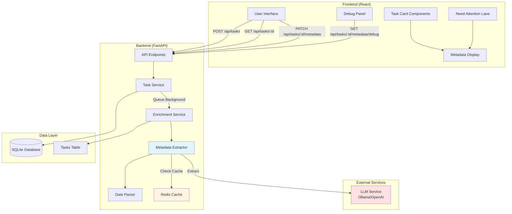

**Key Components**:
- **Metadata Extractor**: Core library for extracting structured metadata using LLM
- **Date Parser**: Utility for parsing relative dates ("tomorrow", "next week") to absolute datetimes
- **Redis Cache**: Caches LLM responses to avoid duplicate extractions
- **Need Attention Lane**: UI component for tasks requiring user input

---

## 2. Task Creation & Extraction Flow

### Sequence Diagram

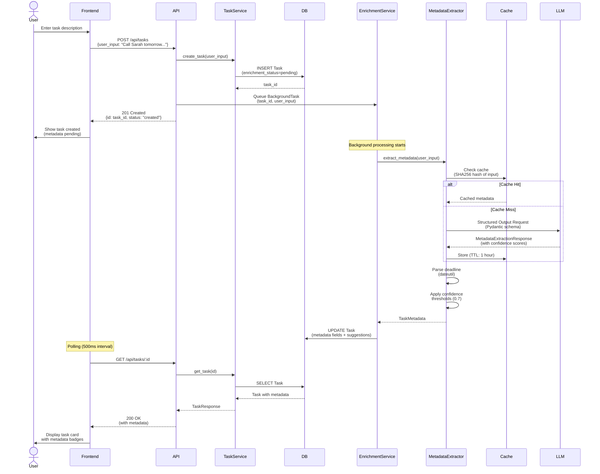

**Key Points**:
- Task creation returns immediately (non-blocking)
- Metadata extraction happens asynchronously in background
- Frontend polls for metadata updates (reuses Feature 001 polling)
- Redis cache prevents duplicate LLM calls for identical inputs

---

## 3. State Transition Diagram

### Task Metadata States

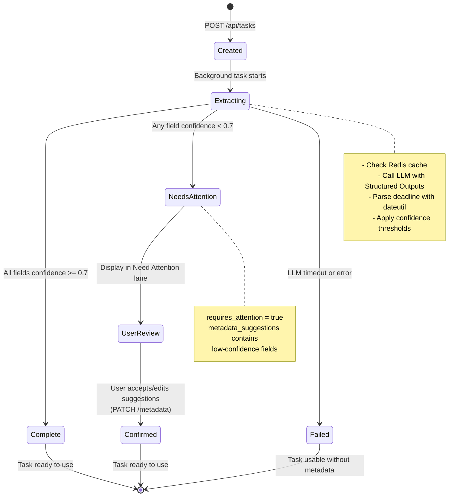

**State Definitions**:
- **Created**: Task created, metadata extraction queued
- **Extracting**: Background task processing (LLM call in progress)
- **Complete**: All metadata fields auto-populated (confidence >= 0.7)
- **NeedsAttention**: One or more fields require user confirmation
- **Confirmed**: User has reviewed and confirmed metadata
- **Failed**: Extraction failed (timeout/error), task still usable without metadata

---

## 4. Data Flow Diagram

### Metadata Extraction Pipeline

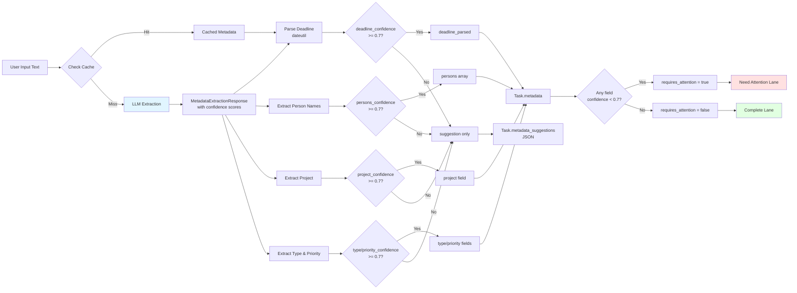

**Confidence Threshold Logic**:
- **>= 0.7**: Auto-populate field, user can edit
- **0.4-0.69**: Show as suggestion in Need Attention lane
- **< 0.4**: Hide suggestion, show empty field

---

## 5. Need Attention Lane Workflow

### User Interaction Flow

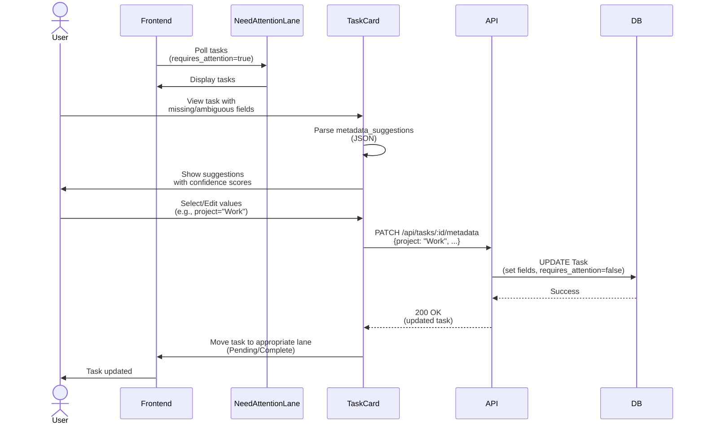

**UI Components**:
- **FieldPrompt**: Shows missing field with input box
- **SuggestedValues**: Dropdown with suggested values + confidence
- **AcceptButton**: Quick-accept all suggestions
- **EditButton**: Manually edit individual fields

---

## 6. Debug Mode Architecture

### Chain of Thought Visibility

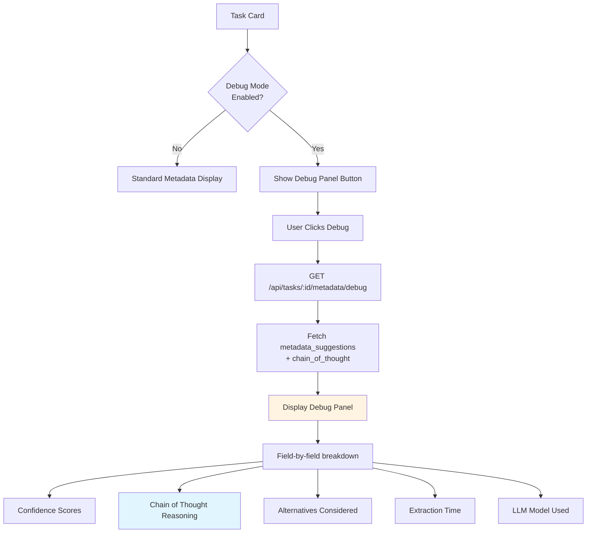

**Debug Panel Information**:
- Per-field confidence scores
- LLM reasoning process (chain of thought)
- Alternative values considered and why rejected
- Extraction performance metrics (time, model)

---

## 7. Caching Strategy

### Redis Cache Flow

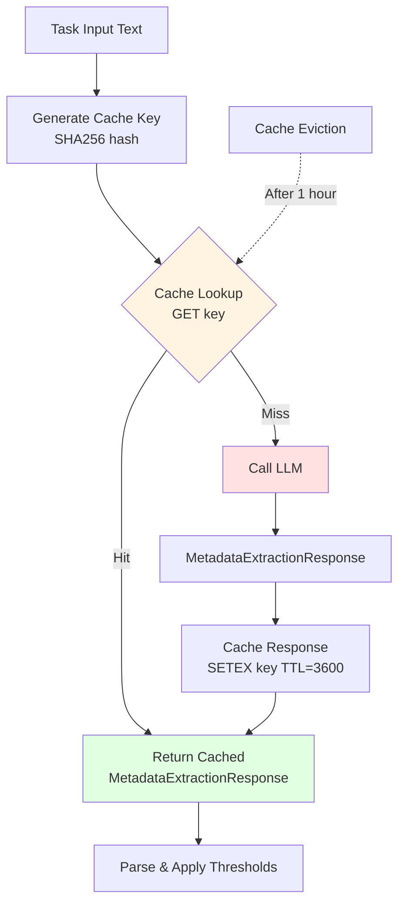

**Cache Configuration**:
- **Key Format**: `metadata:{sha256(task_text)}`
- **TTL**: 3600 seconds (1 hour)
- **Eviction**: LRU (Least Recently Used)
- **Storage**: Redis (shared across backend instances)

**Benefits**:
- Prevents duplicate LLM calls for identical task descriptions
- Reduces extraction time from ~1000ms to <50ms (cache hit)
- Estimated 30% cache hit rate for typical usage

---

## 8. Error Handling and Resilience

### Failure Scenarios

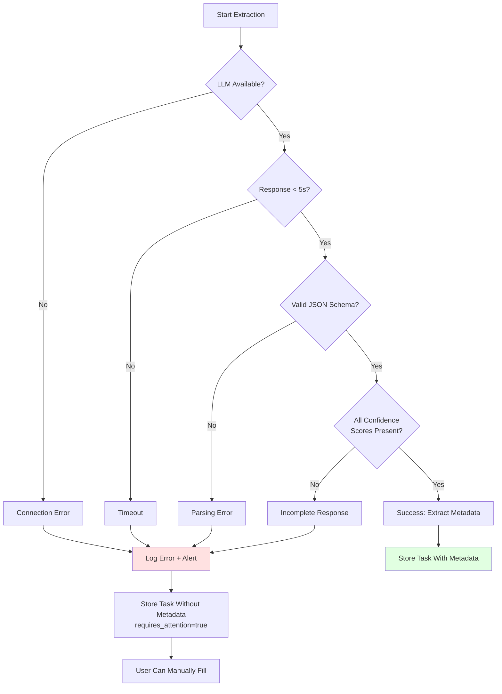

**Graceful Degradation**:
- LLM timeout (>60s via OLLAMA_TIMEOUT): Task still created, metadata empty
- LLM error: Task created, user can manually enter metadata
- Cache failure: Fall back to LLM (no impact on extraction)
- Parsing error: Store raw response, mark for debug review

**Retry Strategy**:
- No automatic retries (avoid cascading failures)
- User can trigger re-extraction via "Retry" button (future feature)

---

## 9. Performance Optimization

### Async Processing Timeline

```mermaid
gantt
    title Metadata Extraction Performance
    dateFormat SSS
    axisFormat %L ms

    section User Experience
    POST /api/tasks (sync)     :done, a1, 000, 50ms
    Return task ID to frontend :milestone, m1, 050, 0ms
    Frontend polling starts    :done, a2, 050, 2000ms

    section Background Processing
    Queue background task      :done, b1, 050, 10ms
    Check Redis cache          :done, b2, 060, 20ms
    LLM extraction call        :active, b3, 080, 1000ms
    Parse deadline             :active, b4, 1080, 10ms
    Apply thresholds           :active, b5, 1090, 5ms
    Update database            :done, b6, 1095, 30ms

    section First Poll Result
    Frontend receives metadata :milestone, m2, 1125, 0ms
```

**Performance Targets**:
- API response time: <50ms (task creation)
- LLM extraction: <1500ms (95th percentile)
- Cache lookup: <20ms
- Total time to metadata: <2000ms (background)

**Bottlenecks**:
- LLM call: 500-1500ms (largest contributor)
- Date parsing: 5-10ms (negligible)
- Database update: 20-30ms (negligible)

---

## 10. Security Considerations

### Data Flow Security

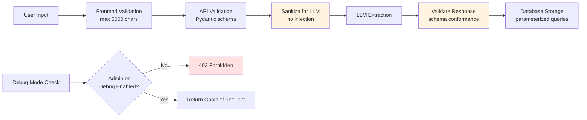

**Security Measures**:
1. **Input Validation**: Length limits, schema validation
2. **LLM Injection Prevention**: Sanitize user input before LLM prompts
3. **Output Validation**: Enforce Pydantic schema on LLM responses
4. **Access Control**: Debug endpoints restricted to admin users
5. **Data Privacy**: Chain of thought data not exposed to regular users

---

## 11. Deployment Architecture

### Docker Container Layout

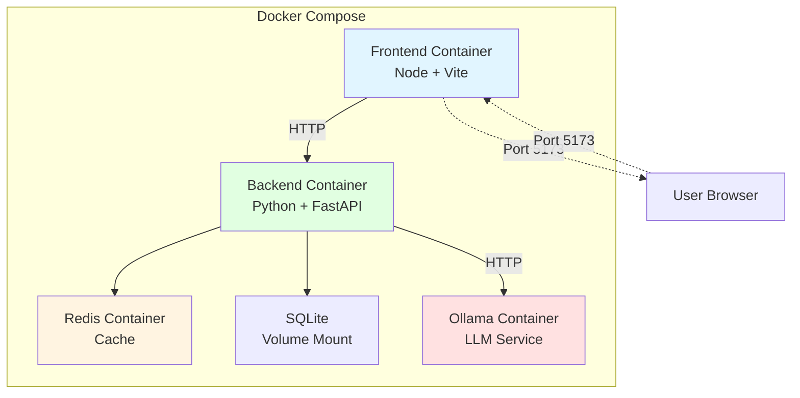

**Configuration**:
- **Frontend**: Port 5173 (Vite dev server)
- **Backend**: Port 8000 (uvicorn)
- **Redis**: Port 6379 (internal)
- **Ollama**: Port 11434 (internal)
- **Database**: `/data/taskmaster.db` (volume)

---

## 12. Monitoring and Observability

### Key Metrics

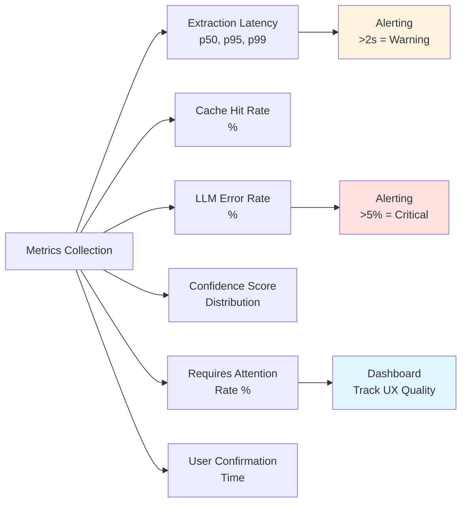

**Observability**:
- Log all extraction attempts (task_id, input_length, extraction_time, confidence_scores)
- Track cache hit/miss ratio
- Monitor LLM timeout frequency
- Measure user confirmation time in Need Attention lane

---

**Last Updated**: 2025-11-05
**Related Documents**: [spec.md](./spec.md), [research.md](./research.md), [data-model.md](./data-model.md)
