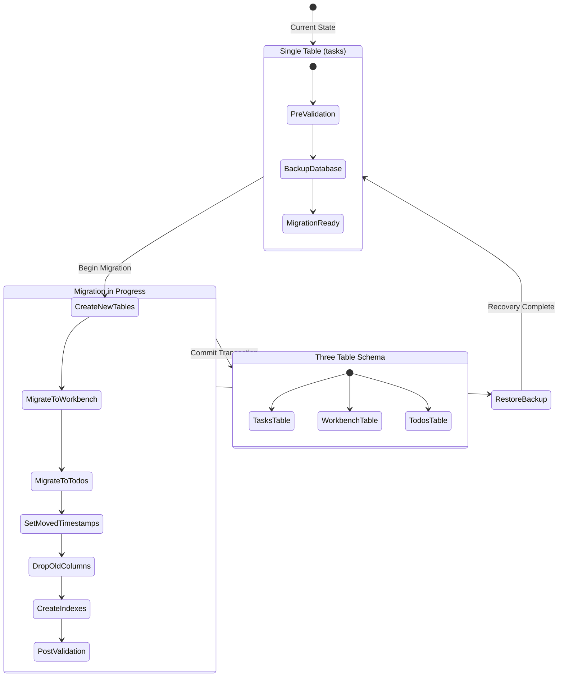
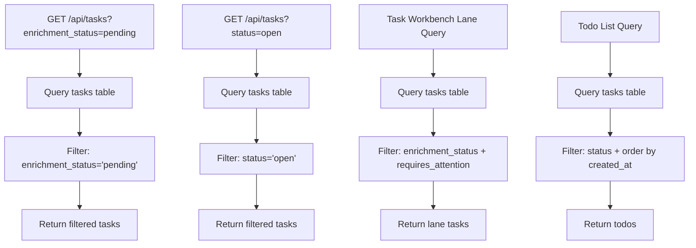
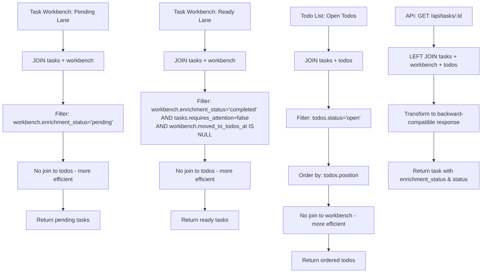
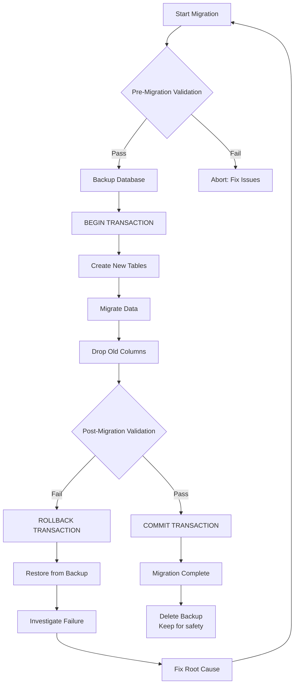
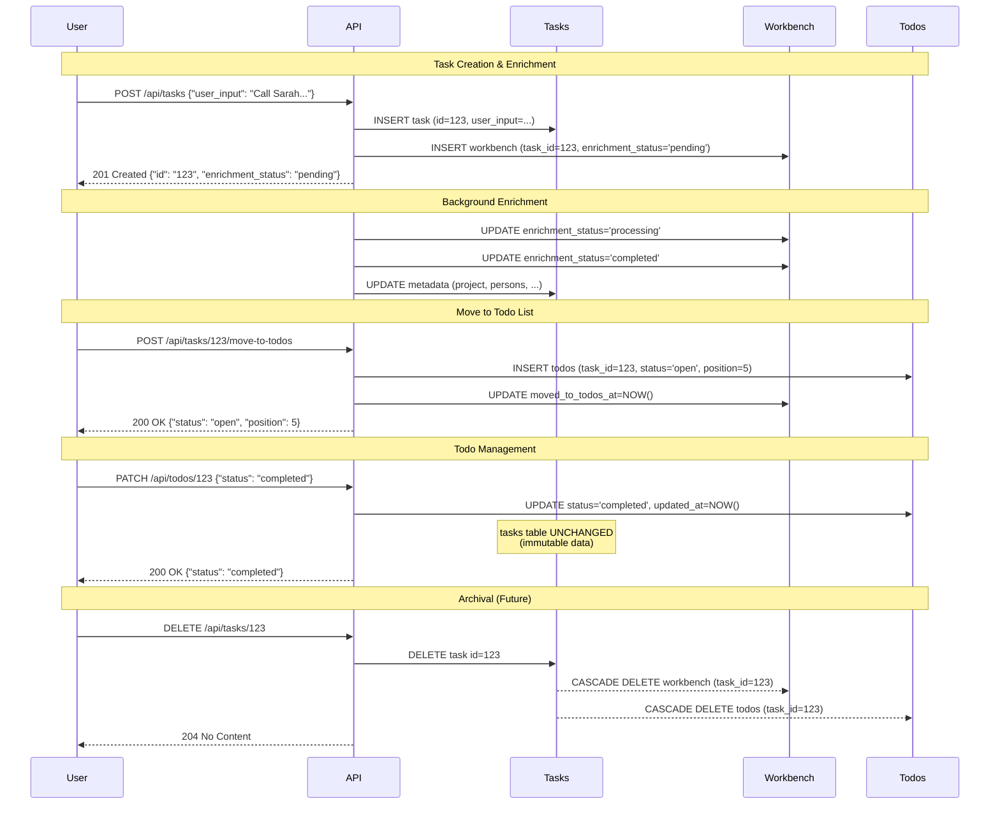

# Architecture Diagrams: Three-Table Schema

**Feature**: 005-three-table-schema
**Date**: 2025-11-15
**Purpose**: Visual documentation of three-table schema architecture, migration flow, and query patterns

---

## Diagram 1: Entity Relationship Diagram (ERD)

```mermaid
erDiagram
    TASKS ||--o| WORKBENCH : "has enrichment state"
    TASKS ||--o| TODOS : "has execution state"

    TASKS {
        string id PK "UUID"
        text user_input "Original task description"
        text enriched_text "LLM-enhanced description"
        string project "Project/category (100 chars)"
        text persons "JSON array of names"
        string task_type "meeting|call|email|review|..."
        string priority "low|normal|high|urgent"
        string deadline_text "Original phrase (200 chars)"
        datetime deadline_parsed "Parsed UTC datetime"
        int effort_estimate "Minutes"
        text dependencies "JSON array"
        text tags "JSON array"
        datetime extracted_at "Metadata extraction timestamp"
        boolean requires_attention "Needs user review"
        datetime created_at "UTC timestamp"
        datetime updated_at "UTC timestamp"
    }

    WORKBENCH {
        string id PK "UUID"
        string task_id FK,UNIQUE "→ tasks.id CASCADE DELETE"
        string enrichment_status "pending|processing|completed|failed"
        text error_message "Error details if failed"
        text metadata_suggestions "JSON: MetadataExtractionResponse"
        datetime moved_to_todos_at "When task moved to todos"
        datetime created_at "UTC timestamp"
        datetime updated_at "UTC timestamp"
    }

    TODOS {
        string id PK "UUID"
        string task_id FK,UNIQUE "→ tasks.id CASCADE DELETE"
        string status "open|completed|archived"
        int position "Drag-drop ordering"
        datetime created_at "UTC timestamp"
        datetime updated_at "UTC timestamp"
    }
```

**Key Points**:
- **One-to-one relationships**: Each task can have at most one workbench entry and at most one todos entry
- **Cascade deletes**: Deleting a task automatically deletes its workbench and todos entries
- **Unique foreign keys**: `workbench.task_id` and `todos.task_id` are UNIQUE, enforcing one-to-one at DB level
- **Lifecycle separation**: Workbench (temporary enrichment state) vs Todos (long-lived execution state)

---

## Diagram 2: Migration State Machine



**Migration Steps**:
1. **Pre-Validation**: Check enum values, foreign key integrity, capture baseline counts
2. **Backup Database**: Copy SQLite file for rollback capability
3. **Create New Tables**: workbench and todos tables with foreign keys
4. **Migrate to Workbench**: Copy enrichment_status + error_message
5. **Migrate to Todos**: Copy status + assign positions
6. **Set moved_to_todos_at**: For tasks in both workbench and todos
7. **Drop Old Columns**: Remove status, enrichment_status, error_message from tasks
8. **Create Indexes**: Add indexes for efficient queries
9. **Post-Validation**: Verify counts, referential integrity
10. **Commit**: All-or-nothing via SQLite transaction

---

## Diagram 3: Query Pattern Comparison (Before vs After)

### Before Migration (Single Table)



**Issues**:
- Single large table scanned for all queries
- No query optimization (enrichment and execution state mixed)
- Difficult to reason about data lifecycle

### After Migration (Three Tables)



**Benefits**:
- **Targeted queries**: Task Workbench queries only join workbench, not todos
- **Smaller tables**: Workbench and todos are smaller than original tasks table
- **Better indexes**: Separate indexes on enrichment_status and status
- **Clear semantics**: Query patterns match conceptual model (enrichment vs execution)

---

## Diagram 4: Rollback & Recovery Flow



**Recovery Procedures**:

**If migration fails during transaction**:
1. SQLite automatically ROLLBACK
2. Database returns to original state
3. Investigate error in migration logs
4. Fix root cause, retry migration

**If migration succeeds but issues found post-deployment**:
1. Stop application
2. Restore from backup: `cp data/tasks.db.backup_pre_migration_005 data/tasks.db`
3. Verify backup integrity: check record counts
4. Restart application on backup database
5. Investigate issue, plan corrected migration

---

## Diagram 5: Task Lifecycle Across Tables



**Lifecycle Summary**:
1. **Creation**: Task + Workbench entries created
2. **Enrichment**: Workbench.enrichment_status updated, Tasks.metadata updated
3. **Graduation**: Todos entry created, Workbench.moved_to_todos_at set
4. **Execution**: Todos.status updated (Task and Workbench unchanged)
5. **Deletion**: All three cascade deleted

---

## Diagram 6: Index Usage for Common Queries

```mermaid
graph TD
    subgraph "Query 1: Pending Lane"
        A1[SELECT * FROM tasks<br/>JOIN workbench<br/>WHERE enrichment_status='pending']
        A2[Index: ix_workbench_enrichment_status]
        A3[Index: ix_workbench_task_id]
        A1 --> A2 --> A3
    end

    subgraph "Query 2: Open Todos Ordered"
        B1[SELECT * FROM tasks<br/>JOIN todos<br/>WHERE status='open'<br/>ORDER BY position]
        B2[Index: ix_todos_status]
        B3[Index: ix_todos_position]
        B4[Index: ix_todos_task_id]
        B1 --> B2 --> B3 --> B4
    end

    subgraph "Query 3: Tasks by Project"
        C1[SELECT * FROM tasks<br/>WHERE project='ProjectX']
        C2[Index: ix_tasks_project]
        C1 --> C2
    end

    subgraph "Query 4: Get Single Task"
        D1[SELECT * FROM tasks<br/>LEFT JOIN workbench<br/>LEFT JOIN todos<br/>WHERE tasks.id=?]
        D2[Primary Key: tasks.id]
        D3[Index: ix_workbench_task_id]
        D4[Index: ix_todos_task_id]
        D1 --> D2 --> D3 --> D4
    end
```



**Index Strategy**:
- **Workbench**: Index on enrichment_status, task_id, moved_to_todos_at
- **Todos**: Index on status, position, task_id
- **Tasks**: Index on project, deadline_parsed (existing)
- **All foreign keys**: Automatically indexed for join performance

---

## Summary

This architecture provides:

✅ **Clear Separation**: Immutable data (tasks) vs workflow state (workbench, todos)
✅ **Query Efficiency**: Targeted joins, smaller tables, better indexes
✅ **Data Integrity**: Foreign keys with CASCADE DELETE, unique constraints
✅ **Rollback Safety**: SQLite transactions + backup restore strategy
✅ **Backward Compatibility**: API responses unchanged via LEFT JOIN transformations
✅ **Visual Clarity**: ERD, state machines, sequence diagrams document the design

## Next Steps

1. ✅ Architecture diagrams complete (ERD + migration flow + query patterns)
2. ⏳ Update agent context with SQLAlchemy patterns
3. ⏳ Generate tasks.md with TDD implementation tasks (/speckit.tasks)
