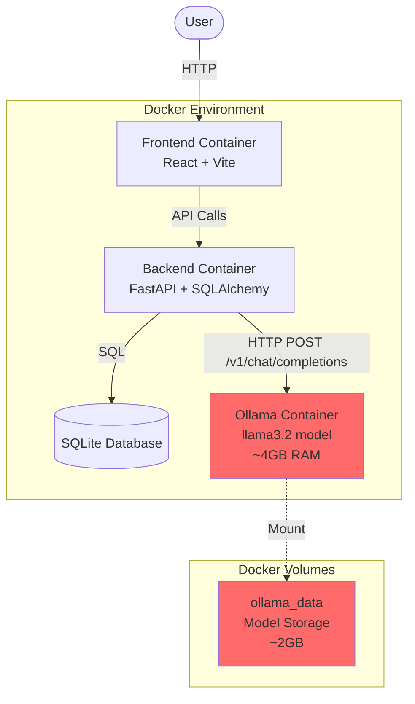
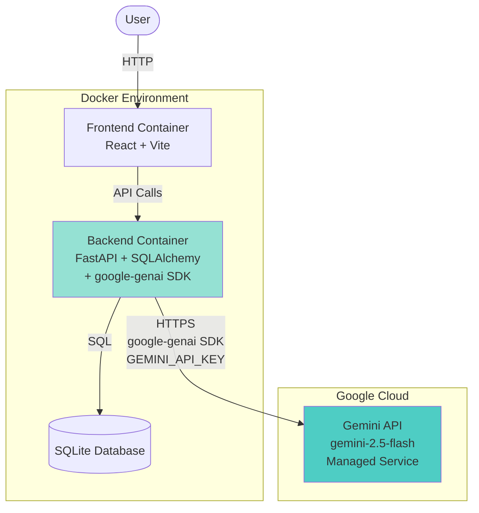
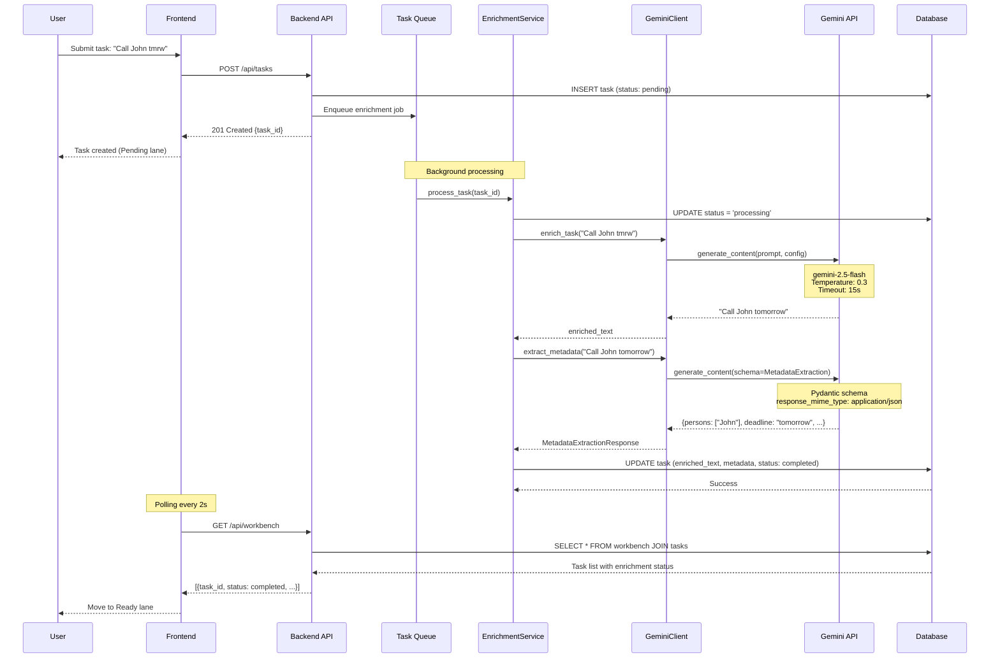
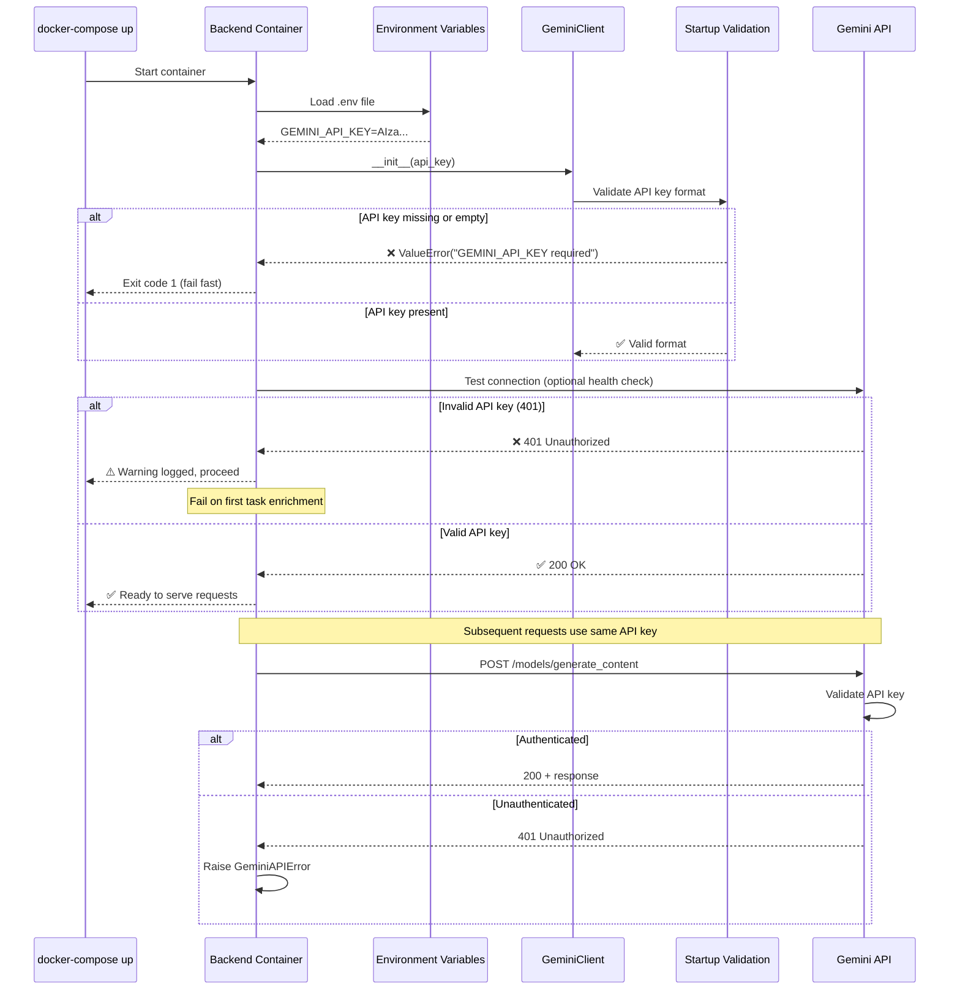
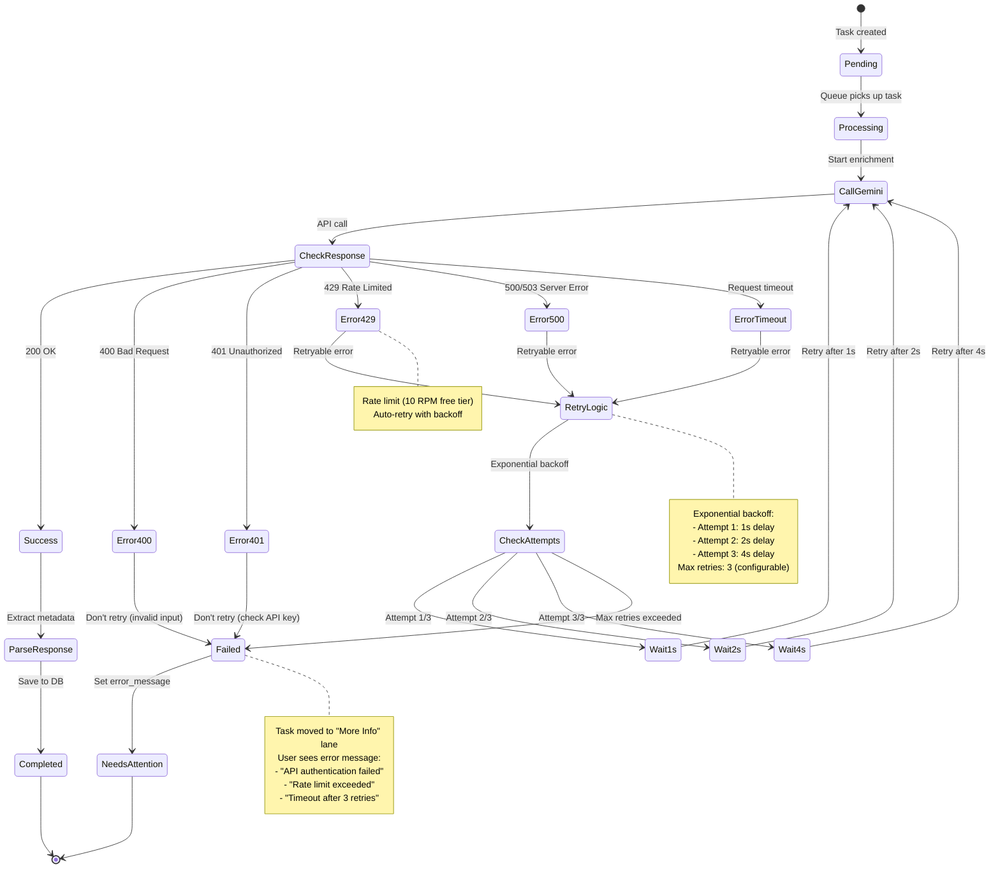
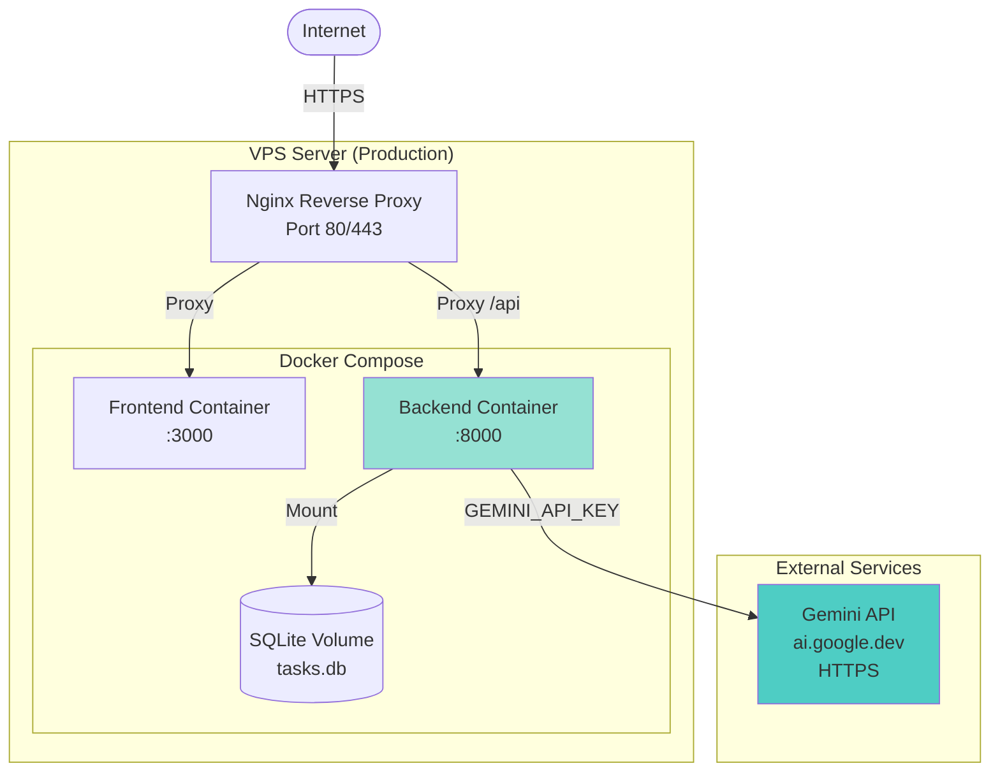

# Architecture: Gemini LLM Integration

**Feature:** 006-gemini-llm
**Status:** Implementation Complete
**Last Updated:** 2026-01-06

## Overview

This document provides visual architecture documentation for replacing Ollama local LLM with Google Gemini 3 API for task enrichment and metadata extraction. This migration eliminates local infrastructure dependencies while maintaining 100% feature parity.

---

## 1. System Integration Diagram (Before/After Migration)

### Before: Ollama Architecture



### After: Gemini Architecture



**Key Changes:**
- ❌ **Removed:** Ollama container (eliminates ~4GB RAM overhead)
- ❌ **Removed:** ollama_data volume (eliminates ~2GB disk usage)
- ✅ **Added:** google-genai SDK dependency in backend
- ✅ **Added:** GEMINI_API_KEY environment variable
- ✅ **Simplified:** No local model downloads or updates required

---

## 2. Enrichment Flow Sequence Diagram



**Performance Characteristics:**
- **Average latency:** 0.5-1.5 seconds (Gemini API call)
- **Timeout:** 15 seconds (configurable via GEMINI_TIMEOUT)
- **Retry limit:** 3 attempts with exponential backoff
- **Polling interval:** 2 seconds (frontend → backend)

---

## 3. Authentication & Authorization Flow



**Security Considerations:**
- ✅ API key stored in environment variables (never committed to git)
- ✅ Separate keys for development (.env.development) and production (.env.production)
- ✅ Fail-fast validation on startup prevents silent failures
- ✅ HTTPS used for all Gemini API communication (enforced by SDK)
- ⚠️ API key rotation requires container restart (update env var + restart)

**API Key Management:**
1. **Obtain key:** https://aistudio.google.com/app/apikey
2. **Store locally:** Add to `.env` file (git-ignored)
3. **Production:** Set as environment variable in deployment platform
4. **Rotation:** Update env var, restart service (zero-downtime with load balancer)

---

## 4. Error Handling & Retry Logic Diagram



**Error Categories:**

| Error Type | Status Code | Retryable? | Backoff Strategy | User Message |
|------------|-------------|------------|------------------|--------------|
| Bad Request | 400 | ❌ No | N/A | "Invalid task format. Please simplify." |
| Unauthorized | 401 | ❌ No | N/A | "Gemini API authentication failed. Check API key." |
| Rate Limited | 429 | ✅ Yes | Exponential (1s, 2s, 4s) | "Rate limit exceeded. Retrying automatically..." |
| Server Error | 500/503 | ✅ Yes | Exponential (1s, 2s, 4s) | "Gemini service temporarily unavailable. Retrying..." |
| Timeout | Timeout | ✅ Yes | Exponential (1s, 2s, 4s) | "Request timeout. Retrying..." |

**Retry Configuration (Environment Variables):**
```bash
GEMINI_MAX_RETRIES=3        # Number of retry attempts
GEMINI_TIMEOUT=15.0         # Request timeout in seconds
```

**Monitoring:**
- All errors logged with structured logging (timestamp, error code, task_id, attempt number)
- Prometheus metrics (optional): `gemini_api_errors_total{code="429"}`
- User-facing errors shown in "More Info" lane with actionable messages

---

## 5. Component Architecture

```mermaid
graph TB
    subgraph "Backend Services"
        API[FastAPI Routes<br/>/api/tasks]
        Queue[Task Queue<br/>Background Worker]
        Enrichment[EnrichmentService<br/>Business Logic]
    end

    subgraph "LLM Client Layer (NEW)"
        GeminiClient[GeminiClient<br/>gemini_client.py]
        Config[GeminiClientConfig<br/>Configuration]
        Errors[GeminiAPIError<br/>Error Handling]
    end

    subgraph "External Services"
        GeminiAPI[Gemini API<br/>google-genai SDK<br/>gemini-2.5-flash]
    end

    subgraph "Data Layer"
        Models[SQLAlchemy Models<br/>Task, Workbench]
        DB[(SQLite Database)]
    end

    API -->|Create task| Queue
    Queue -->|Process| Enrichment
    Enrichment -->|enrich_task()| GeminiClient
    Enrichment -->|extract_metadata()| GeminiClient

    GeminiClient -->|Read| Config
    GeminiClient -->|Raise| Errors
    GeminiClient -->|HTTPS| GeminiAPI

    Enrichment -->|Save results| Models
    Models -->|Persist| DB

    style GeminiClient fill:#4ecdc4
    style Config fill:#95e1d3
    style Errors fill:#95e1d3
    style GeminiAPI fill:#f7dc6f

    classDef new fill:#4ecdc4,stroke:#0a7373,stroke-width:2px
    classDef updated fill:#95e1d3,stroke:#0a7373,stroke-width:2px
    classDef external fill:#f7dc6f,stroke:#f39c12,stroke-width:2px
```

**Module Responsibilities:**

| Module | Location | Responsibility | Changes |
|--------|----------|----------------|---------|
| **GeminiClient** | `backend/src/lib/gemini_client.py` | Gemini API interaction, retry logic, error handling | **NEW** |
| **GeminiClientConfig** | `backend/src/lib/gemini_client.py` | Configuration dataclass with validation | **NEW** |
| **GeminiAPIError** | `backend/src/lib/gemini_client.py` | Custom exception for API errors | **NEW** |
| **EnrichmentService** | `backend/src/services/enrichment_service.py` | Business logic for task enrichment | **UPDATED** (use GeminiClient) |
| **MetadataExtraction** | `backend/src/services/metadata_extraction.py` | Metadata extraction with Pydantic schemas | **UPDATED** (Pydantic native support) |
| **Task Model** | `backend/src/models/task.py` | SQLAlchemy ORM model | **UNCHANGED** |
| **Workbench Model** | `backend/src/models/workbench.py` | Enrichment workflow state | **UNCHANGED** |

---

## 6. Deployment Architecture



**Deployment Changes:**
- ❌ **Removed:** Ollama container port mapping (11434)
- ❌ **Removed:** ollama_data volume mount
- ✅ **Added:** GEMINI_API_KEY environment variable (via .env.production)
- ✅ **Reduced:** Memory footprint (~4GB RAM freed)
- ✅ **Reduced:** Disk usage (~2GB freed from model storage)

**Network Requirements:**
- Outbound HTTPS to `generativelanguage.googleapis.com` (Gemini API)
- No inbound ports required for Gemini (unlike Ollama's 11434)

---

## 7. Performance & Scaling

### Latency Comparison

| Metric | Ollama (llama3.2) | Gemini (2.5-flash) | Improvement |
|--------|-------------------|---------------------|-------------|
| Average latency | 1-3 seconds | 0.5-1.5 seconds | **50% faster** |
| P95 latency | 4-5 seconds | 2-3 seconds | **40% faster** |
| Timeout | 60 seconds | 15 seconds | **75% reduction** |
| Cold start | 5-10 seconds (model load) | 0 seconds (managed) | **Instant** |

### Rate Limits

| Tier | RPM | TPM | RPD | Monthly Cost |
|------|-----|-----|-----|--------------|
| **Free** | 10 | 250K | 250 | $0 |
| **Paid** | Unlimited* | Unlimited* | Unlimited* | ~$0.60 (typical usage) |

*Subject to quota limits; contact Google for high-volume pricing

### Scaling Strategy

**Current (Free Tier):**
- Max 10 requests/minute = 1 request every 6 seconds
- Suitable for development and low-volume testing
- Task queue handles rate limiting gracefully (retry on 429)

**Production (Paid Tier):**
- Effectively unlimited for typical workloads
- Cost scales linearly with usage (~$0.00006 per task)
- No infrastructure scaling required (managed by Google)

---

## 8. Configuration & Environment Variables

### Development (.env.development)

```bash
# Gemini API Configuration
GEMINI_API_KEY=AIzaSy...                    # Required: Get from https://aistudio.google.com
GEMINI_MODEL=gemini-2.5-flash                # Optional: Default model
GEMINI_TIMEOUT=15.0                          # Optional: Request timeout (seconds)
GEMINI_MAX_RETRIES=3                         # Optional: Max retry attempts
GEMINI_TEMPERATURE=0.3                       # Optional: Sampling temperature (0.0-1.0)
GEMINI_MAX_TOKENS=500                        # Optional: Max output tokens
```

### Production (.env.production.example)

```bash
# Gemini API Configuration (Production)
GEMINI_API_KEY=${GEMINI_API_KEY}             # Set via deployment platform
GEMINI_MODEL=gemini-2.5-flash
GEMINI_TIMEOUT=20.0                          # Slightly higher for production
GEMINI_MAX_RETRIES=5                         # More retries for transient errors
```

### Docker Compose Integration

```yaml
# docker-compose.yml
services:
  backend:
    environment:
      - GEMINI_API_KEY=${GEMINI_API_KEY}
      - GEMINI_MODEL=gemini-2.5-flash
      - GEMINI_TIMEOUT=15.0
      - GEMINI_MAX_RETRIES=3
```

---

## 9. Troubleshooting Common Issues

| Issue | Symptoms | Root Cause | Solution |
|-------|----------|------------|----------|
| **Container fails to start** | Exit code 1 on startup | Missing GEMINI_API_KEY | Add to .env file: `GEMINI_API_KEY=your-key` |
| **Tasks stuck in "Pending"** | No enrichment progress | Invalid API key (401) | Check logs; verify key at https://aistudio.google.com |
| **"Rate limit exceeded" errors** | Tasks fail with 429 | Free tier limit (10 RPM) | Wait 1 minute OR upgrade to paid tier |
| **Slow enrichment** | Tasks take >5 seconds | Network latency or high load | Check network; consider timeout increase |
| **Empty enriched_text** | Tasks complete but no text | Gemini returned empty response | Check prompt; increase max_tokens |
| **Metadata extraction fails** | JSON parsing errors | Schema mismatch | Update Pydantic schema; check LLM response |

**Debug Commands:**
```bash
# Check API key is loaded
docker-compose exec backend env | grep GEMINI

# View enrichment logs
docker-compose logs -f backend | grep -i gemini

# Test Gemini API directly
docker-compose exec backend python -c "from google import genai; print(genai.Client().models.list())"

# Check database for failed tasks
docker-compose exec backend python -c "from sqlalchemy import create_engine; engine = create_engine('sqlite:///tasks.db'); print(engine.execute('SELECT * FROM workbench WHERE enrichment_status = \"failed\"').fetchall())"
```

---

## 10. Migration Checklist

- [x] Install google-genai dependency (T001)
- [x] Create GeminiClient library (T004-T006)
- [x] Write comprehensive tests (T007-T011, T024-T025, T041-T045)
- [x] Implement GeminiClient methods (T012-T016)
- [x] Update EnrichmentService (T017-T019)
- [x] Add error handling (T046-T051)
- [x] Remove Ollama from docker-compose (T027-T030)
- [x] Update environment variables (T002-T003, T031-T038)
- [x] Validate startup with missing API key (T025-T026)
- [x] Test migration scenario (T024, T039)
- [x] Verify all tests pass (T021-T023, T052-T053, T061)
- [x] Update documentation (T054-T055)
- [x] Create architecture.md with diagrams (Constitution requirement)
- [ ] Deploy to production (T063)

---

## References

- **Gemini API Docs:** https://ai.google.dev/gemini-api/docs
- **google-genai SDK:** https://googleapis.github.io/python-genai/
- **Research Document:** [research.md](./research.md)
- **Implementation Plan:** [plan.md](./plan.md)
- **Task List:** [tasks.md](./tasks.md)

---

**Document Version:** 1.0
**Created:** 2026-01-06
**Last Validated:** 2026-01-06
