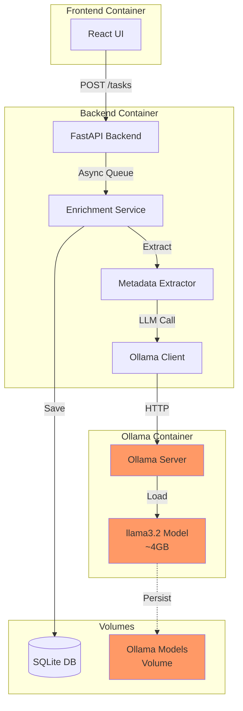
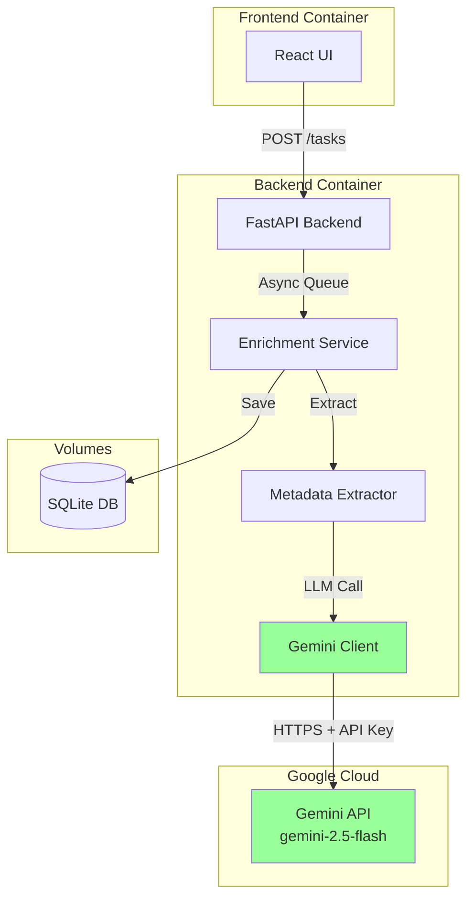
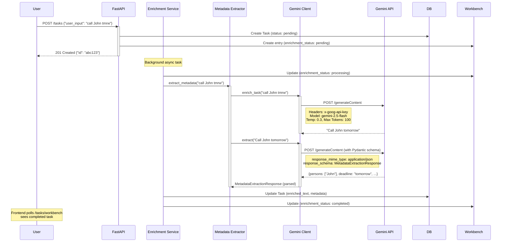
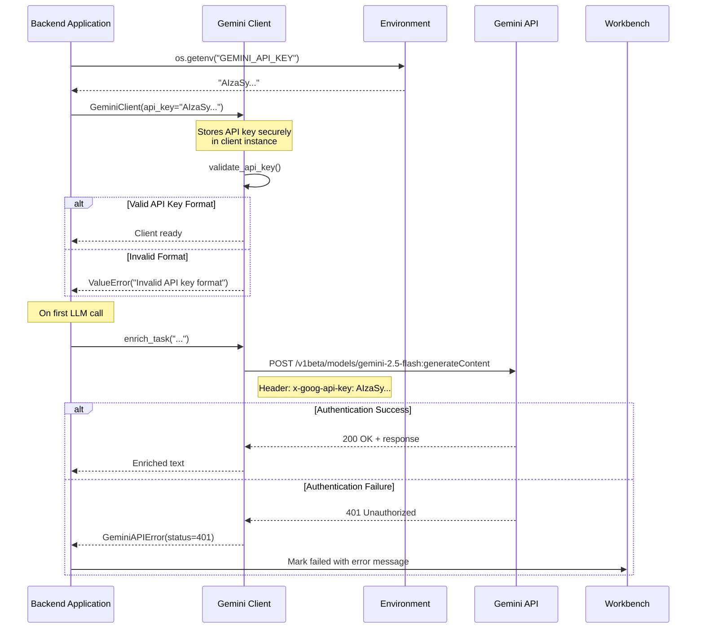
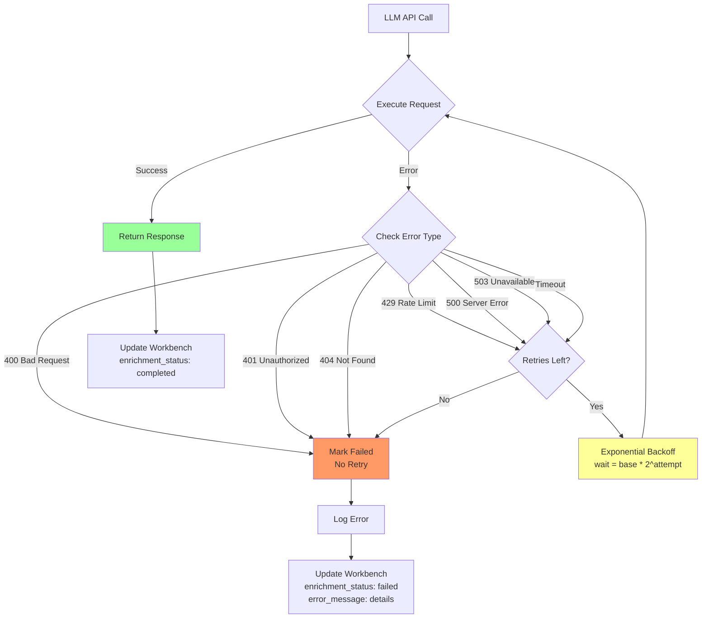
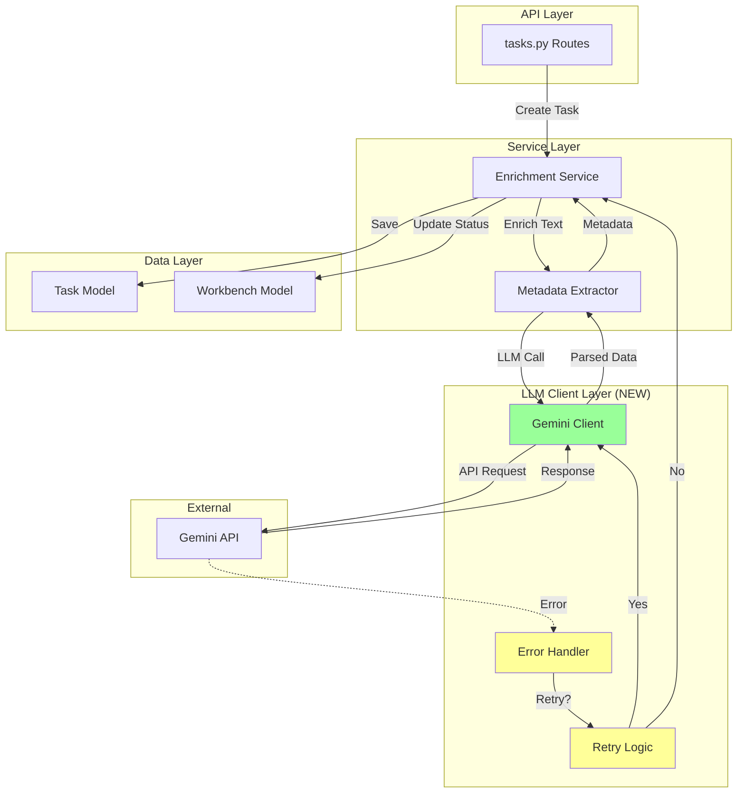
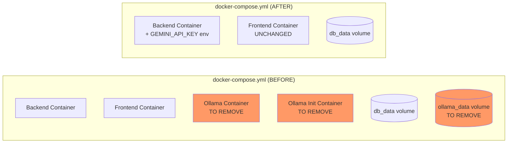
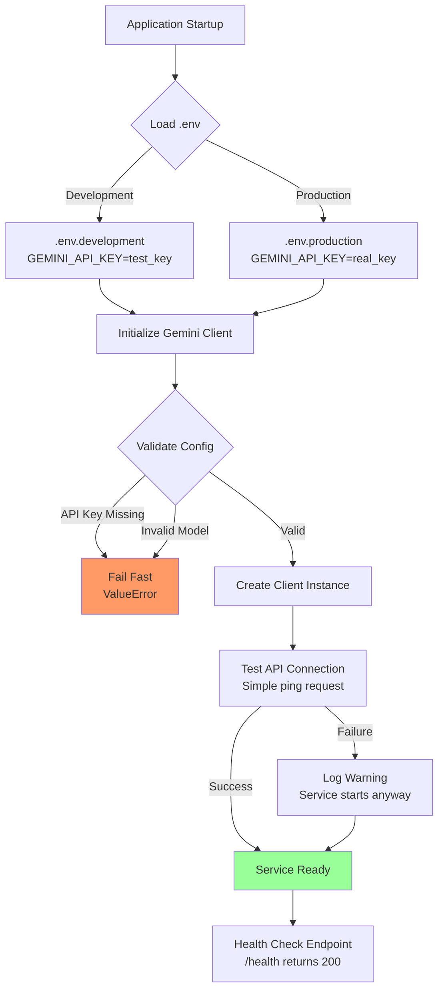
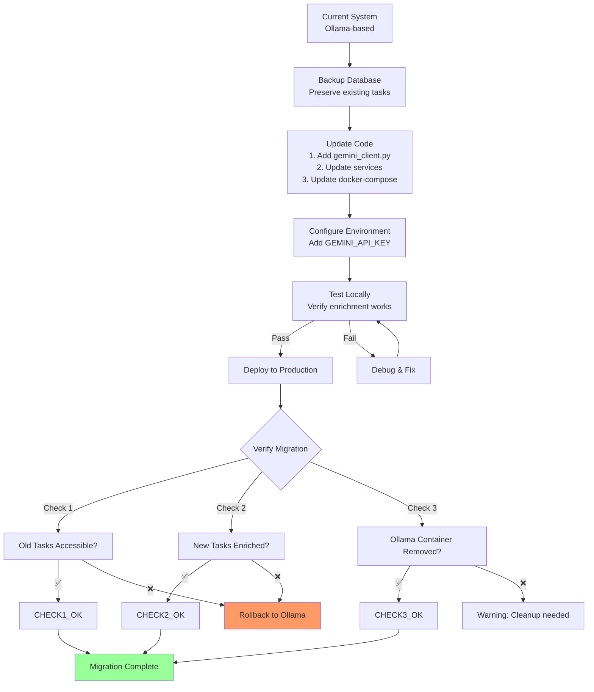

# Architecture: Gemini LLM Integration

## Overview

This document provides visual architecture diagrams for replacing the Ollama local LLM with Google's Gemini API. All diagrams use Mermaid format for consistency and renderability.

---

## System Integration Diagram

### Before: Ollama Architecture



### After: Gemini Architecture



**Key Changes:**
- ❌ **Removed:** Ollama container, model volume, local inference
- ✅ **Added:** Gemini client library, cloud API integration
- ✅ **Simplified:** No Docker volumes, no model downloads, no GPU requirements

---

## Sequence Diagram: Enrichment Flow with Gemini



**Timing Expectations:**
- Enrichment: 0.5-1.5s (avg 1s)
- Metadata extraction: 0.5-1.5s (avg 1s)
- **Total**: 1-3s (avg 2s) - matches/improves Ollama

---

## Authentication Flow



**Environment Variables:**
```bash
# Required
GEMINI_API_KEY=AIzaSy...  # Get from https://aistudio.google.com/

# Optional (with defaults)
GEMINI_MODEL=gemini-2.5-flash
GEMINI_TIMEOUT=15.0
GEMINI_MAX_RETRIES=3
```

---

## Error Handling and Retry Logic



**Retry Configuration:**
```python
# Exponential backoff with jitter
retry_options = HttpRetryOptions(
    max_retries=3,
    initial_backoff=1.0,    # 1 second
    max_backoff=60.0,       # 60 seconds
    backoff_multiplier=2.0,  # Exponential (1s, 2s, 4s)
    jitter=True             # Add randomness to prevent thundering herd
)
```

**Error Messages to User:**
- 401: "Gemini API authentication failed. Please check your API key."
- 429: "Rate limit exceeded. Task will retry automatically."
- 500/503: "Gemini service temporarily unavailable. Retrying..."
- Timeout: "Gemini API timeout. Task will retry."
- Other: "Enrichment failed: {error_message}"

---

## Component Interaction Diagram



**Dependency Flow:**
```
routes.tasks → enrichment_service
enrichment_service → metadata_extraction
metadata_extraction → gemini_client
gemini_client → google.genai (external SDK)
```

**Key Interfaces:**
1. `GeminiClient.enrich_task(text: str) → str`
2. `GeminiClient.extract_metadata(text: str, schema: Type[BaseModel]) → BaseModel`
3. `MetadataExtractor.extract(task_text: str) → MetadataExtractionResponse`

---

## Deployment Changes

### Docker Compose Modification



**Changes:**
```yaml
# REMOVE these services
services:
  ollama:        # DELETE entire service
  ollama-init:   # DELETE entire service

# REMOVE this volume
volumes:
  ollama_data:   # DELETE entire volume

# UPDATE backend service
services:
  backend:
    environment:
      - GEMINI_API_KEY=${GEMINI_API_KEY}  # ADD
      - GEMINI_MODEL=${GEMINI_MODEL:-gemini-2.5-flash}  # ADD
      # REMOVE: OLLAMA_BASE_URL, OLLAMA_MODEL, OLLAMA_TIMEOUT
```

---

## Configuration Flow



**Startup Validation:**
```python
# backend/src/lib/gemini_client.py

def validate_config(config: GeminiClientConfig) -> None:
    """Validate Gemini client configuration at startup."""
    if not config.api_key:
        raise ValueError(
            "GEMINI_API_KEY environment variable is required. "
            "Get your API key from https://aistudio.google.com/"
        )

    if not config.api_key.startswith("AIza"):
        raise ValueError("Invalid Gemini API key format")

    supported_models = ["gemini-2.5-flash", "gemini-2.5-pro", "gemini-2.0-flash-exp"]
    if config.model not in supported_models:
        raise ValueError(f"Unsupported model: {config.model}")
```

---

## Migration Strategy Diagram



**Migration Checklist:**
1. ✅ Existing tasks remain accessible (no data loss)
2. ✅ New tasks use Gemini API
3. ✅ Enrichment latency ≤ Ollama performance
4. ✅ Error handling works (rate limits, timeouts)
5. ✅ Ollama containers removed from docker-compose
6. ✅ Ollama volumes can be safely deleted
7. ✅ API costs within budget ($0.60/month estimated)

---

## Summary

This architecture provides:

1. **Clean separation**: LLM client abstraction isolates Gemini SDK
2. **Zero downtime**: Existing tasks preserved, new tasks use Gemini
3. **Robust error handling**: Exponential backoff, clear error messages
4. **Simplified deployment**: No Docker volumes, no model downloads
5. **Cost monitoring**: API usage logged for cost tracking
6. **Feature parity**: Same enrichment capabilities as Ollama

**Next Steps:** Proceed to `/speckit.tasks` to generate implementation tasks.
