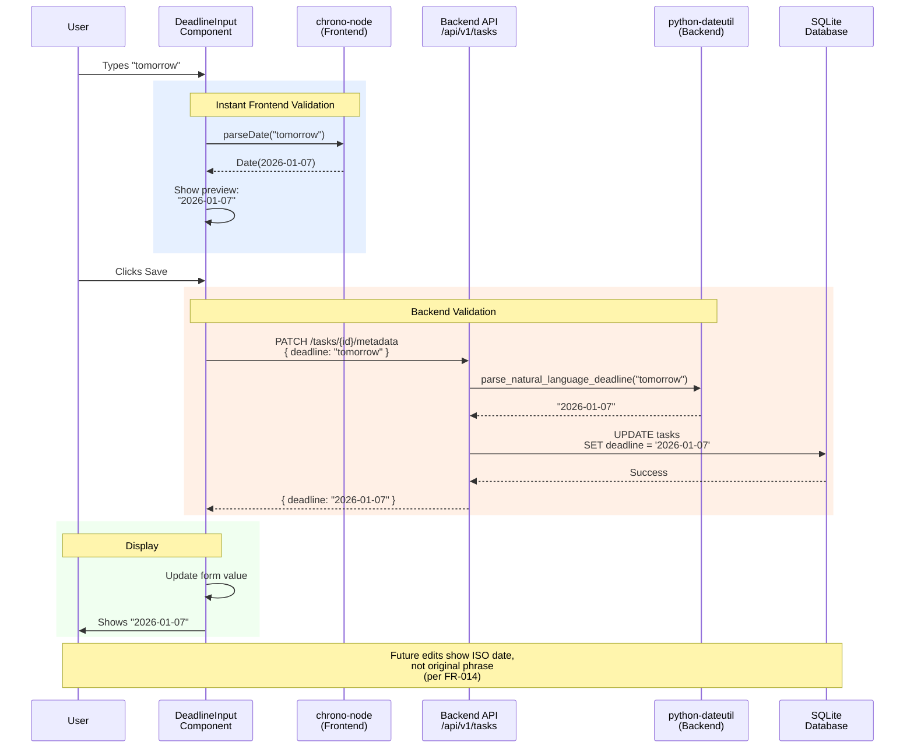
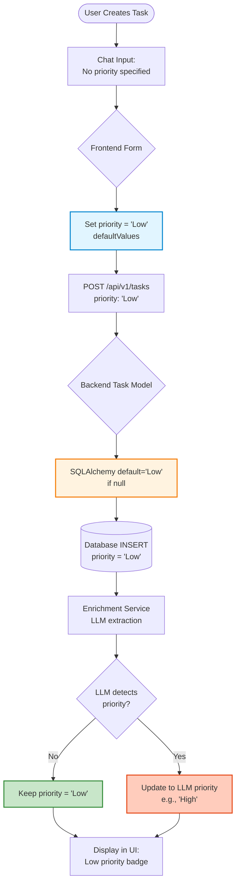
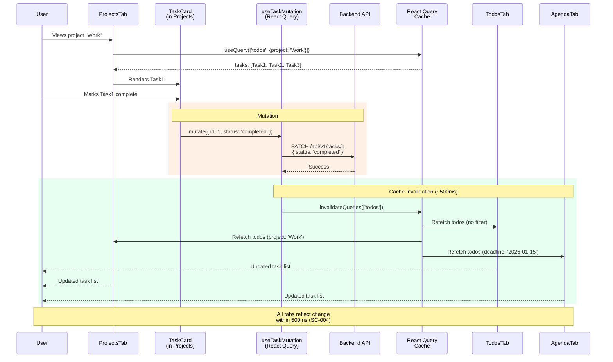

# Architecture: Task Management UI Enhancements

**Feature**: 008-ui-enhancements
**Date**: 2026-01-06
**Purpose**: Visual documentation of component composition, data flow, and state management for UI enhancements

## Overview

This feature enhances the task management UI through three independent improvements:
1. **Default Priority**: Tasks default to "Low" priority to reduce data entry friction
2. **Natural Language Deadlines**: Convert "tomorrow", "next Friday" to ISO dates
3. **Unified Tab Views**: Projects/Agenda/Persons tabs reuse Todos UI with filtering

All enhancements build on existing architecture without new database tables or API endpoints.

---

## Diagram 1: Component Composition Hierarchy

**Purpose**: Shows how tab views compose the shared TaskListView component

```mermaid
graph TB
    App[App Root]
    Tabs[Tabs Container]
    TodosTab[TodosTab]
    ProjectsTab[ProjectsTab]
    AgendaTab[AgendaTab]
    PersonsTab[PersonsTab]

    TaskListView[TaskListView Component<br/>filter?: TaskFilter]
    useFilteredTasks[useFilteredTasks Hook<br/>React Query]

    TaskCard1[TaskCard]
    TaskCard2[TaskCard]
    TaskCard3[TaskCard]
    TaskCard4[TaskCard]

    App --> Tabs
    Tabs --> TodosTab
    Tabs --> ProjectsTab
    Tabs --> AgendaTab
    Tabs --> PersonsTab

    TodosTab -->|filter: undefined| TaskListView
    ProjectsTab -->|filter: project| TaskListView
    AgendaTab -->|filter: deadline| TaskListView
    PersonsTab -->|filter: person| TaskListView

    TaskListView --> useFilteredTasks
    useFilteredTasks -->|tasks: Task[]| TaskListView

    TaskListView --> TaskCard1
    TaskListView --> TaskCard2
    TaskListView --> TaskCard3
    TaskListView --> TaskCard4

    style TaskListView fill:#e1f5ff,stroke:#0288d1,stroke-width:3px
    style useFilteredTasks fill:#fff3e0,stroke:#f57c00,stroke-width:2px
    style TaskCard1 fill:#f3e5f5,stroke:#7b1fa2
    style TaskCard2 fill:#f3e5f5,stroke:#7b1fa2
    style TaskCard3 fill:#f3e5f5,stroke:#7b1fa2
    style TaskCard4 fill:#f3e5f5,stroke:#7b1fa2
```

**Key Points**:
- **Single Shared Component**: TaskListView is rendered by all 4 tabs
- **Filter Prop**: Each tab passes different filter criteria (project, deadline, person, or undefined)
- **React Query Caching**: useFilteredTasks hook shares cache across tabs (edit in one, updates all)
- **TaskCard Unchanged**: Existing component handles all display needs (priority badges, deadline indicators)

---

## Diagram 2: Natural Language Deadline Parsing Flow

**Purpose**: Shows data flow from user input to storage and display



**Key Points**:
- **Dual Parsing**: Frontend (chrono-node) for instant UX, Backend (python-dateutil) for validation
- **Stored as ISO Date**: "tomorrow" permanently becomes "2026-01-07" (no recalculation - per FR-011)
- **Display**: Editing shows calculated date, not original phrase (per FR-014)
- **Validation**: Backend rejects invalid inputs ("someday") with helpful error messages

---

## Diagram 3: Priority Default Propagation

**Purpose**: Shows how "Low" default flows through task creation and enrichment



**Key Points**:
- **Dual Defaults**: Frontend form + Backend model ensure priority is never null
- **LLM Respect**: Enrichment service doesn't overwrite priority unless LLM detects different value
- **Backward Compatibility**: Existing tasks with null priority display as "Low" (UI-level default)
- **User Override**: Users can manually change priority in MetadataEditor (overrides default)

---

## Diagram 4: Cross-Tab Update Propagation

**Purpose**: Shows how edits in one tab automatically update other tabs via React Query cache invalidation



**Key Points**:
- **Automatic Cache Invalidation**: useTaskMutation calls `queryClient.invalidateQueries(['todos'])` after any mutation
- **Shared Query Key**: All tabs use query key pattern `['todos', filter]` - invalidation affects all
- **Optimistic Updates**: Can optionally update cache immediately before API response (instant UX)
- **Performance**: Invalidation + refetch completes <500ms (React Query batches concurrent refetches)

---

## Implementation Notes

### Component Files

**New Components**:
- `frontend/src/components/TaskList/TaskListView.tsx` - Filtered task list wrapper
- `frontend/src/components/TaskWorkbench/DeadlineInput.tsx` - Natural language date input
- `frontend/src/components/Tabs/ProjectsTab.tsx` - Project-filtered view
- `frontend/src/components/Tabs/AgendaTab.tsx` - Deadline-filtered view
- `frontend/src/components/Tabs/PersonsTab.tsx` - Person-filtered view

**Modified Components**:
- `frontend/src/components/TaskWorkbench/MetadataEditor.tsx` - Add priority default
- `frontend/src/components/Tabs/TodosTab.tsx` - Refactor to use TaskListView

**Reused (Unchanged)**:
- `frontend/src/components/TaskCard.tsx` - Already handles priority display, deadline indicators

### Hooks

**New Hooks**:
- `frontend/src/hooks/useFilteredTasks.ts` - React Query hook with filter support
- `frontend/src/hooks/useTaskSorting.ts` - Multi-criteria sorting (priority + deadline)

**Modified Hooks**:
- `frontend/src/hooks/useTasks.ts` - Add optional filter parameter

### Utilities

**New Utilities**:
- `frontend/src/lib/dateUtils.ts` - Natural language date parsing (chrono-node)
- `frontend/src/lib/taskSorting.ts` - Sorting comparator functions
- `backend/src/lib/date_utils.py` (optional) - Backend date validation

### Backend Changes

**Modified Models**:
- `backend/src/models/task.py` - Add `default="Low"` to priority column

**No New Endpoints**: All functionality uses existing `/api/v1/tasks` and `/api/v1/todos` endpoints with query parameters

---

## Performance Considerations

| Operation | Target | Implementation |
|-----------|--------|----------------|
| Priority default (form load) | <10ms | React Hook Form defaultValues (instant) |
| Natural language date parsing (frontend) | <50ms | chrono-node (synchronous parsing) |
| Natural language date validation (backend) | <100ms | python-dateutil (cached in FastAPI) |
| Tab switching | <200ms | React Query cache (no API call if cached) |
| Cross-tab update propagation | <500ms | Query invalidation + concurrent refetch |
| Task sorting (100 tasks) | <5ms | Native Array.sort() O(n log n) |

**Cache Strategy**:
- React Query caches tasks for 5 minutes (staleTime: 300000)
- Background refetch keeps data fresh without blocking UI
- Invalidation on mutation ensures immediate consistency

---

## Testing Strategy

### Unit Tests

- `dateUtils.test.ts`: 12+ test cases for natural language parsing edge cases
- `taskSorting.test.ts`: Multi-criteria sorting with nulls
- `priorityDefaults.test.ts`: Form initialization with default values

### Component Tests

- `DeadlineInput.test.tsx`: User types "tomorrow", sees preview, saves, displays ISO date
- `TaskListView.test.tsx`: Filter prop correctly filters tasks
- `MetadataEditor.test.tsx`: Priority selector defaults to "Low" when task.priority is null

### Integration Tests

- Task creation with default priority flows through backend
- Date parsing validation rejects invalid inputs
- Tab filtering queries return correct subsets

### E2E Tests (Optional)

- User creates task → defaults to Low priority → appears in all relevant tabs
- User enters "next Friday" → saves → reopens → sees ISO date
- User completes task in Projects tab → updates Todos tab within 500ms

---

## Migration Considerations

**Backward Compatibility**:
- Existing tasks with `priority = null` will display as "Low" (UI-level default via `??` operator)
- No database migration needed (default is application-level, not schema-level constraint)
- Existing components continue working unchanged (TaskCard, sorting already handles null priorities)

**Rollout Strategy**:
1. Deploy backend with priority default
2. Deploy frontend with new components
3. Monitor for edge cases in date parsing (validate error logs)
4. Gradually enable tabs (Todos → Projects → Agenda → Persons)
