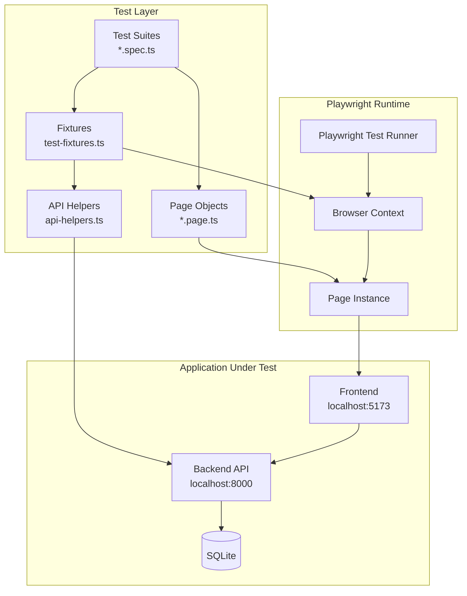
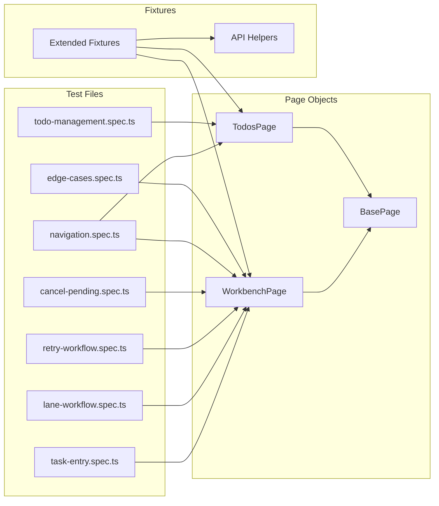
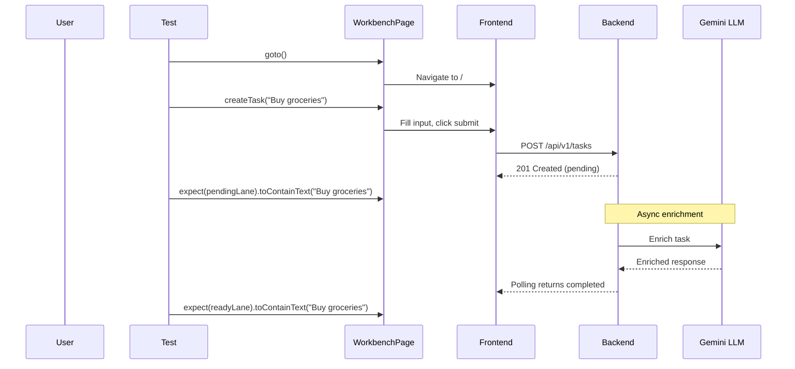
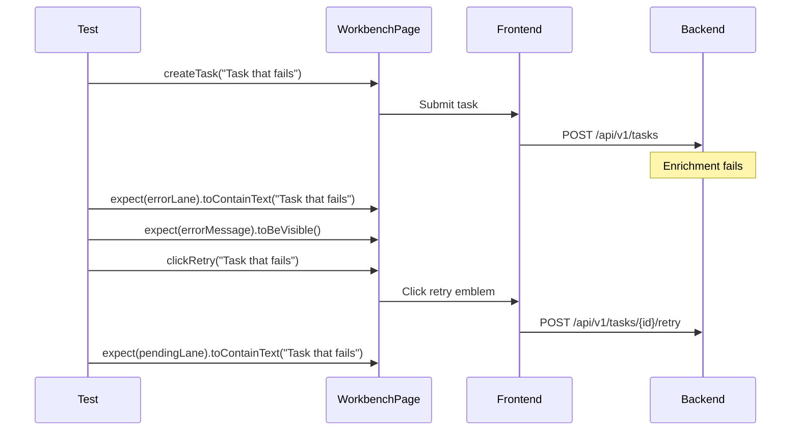
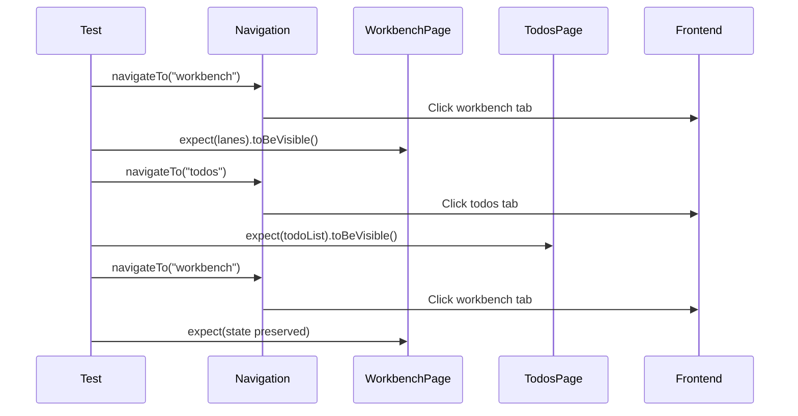
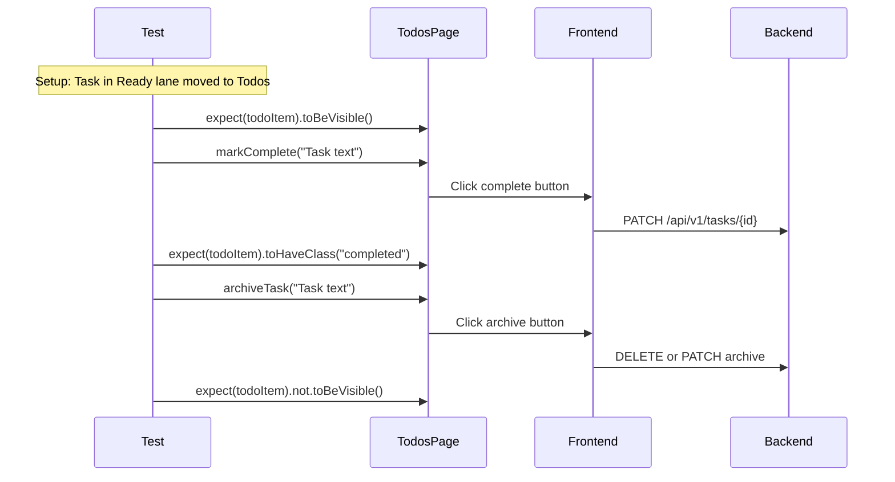
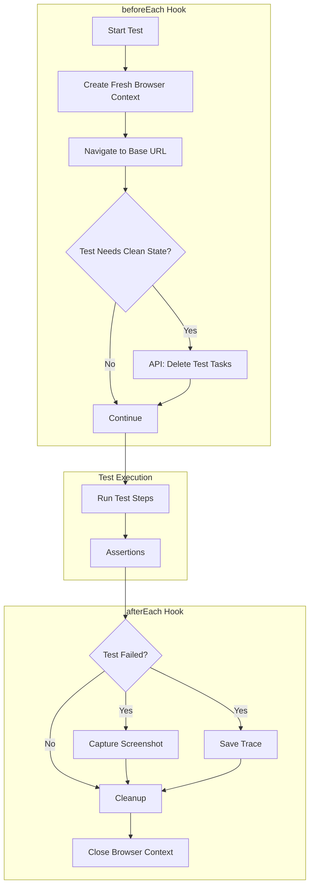
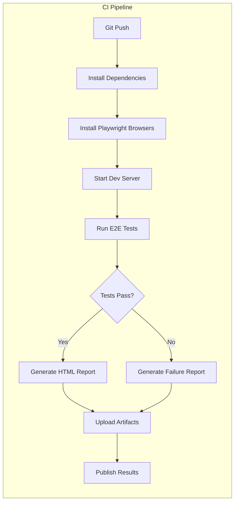
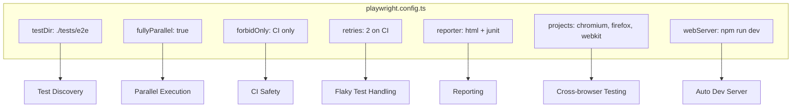

# Architecture: Playwright End-to-End Tests

**Feature**: 009-playwright-tests
**Date**: 2026-01-30

## Test Architecture Overview



## Component Hierarchy



## User Flow Diagrams

### US1 & US2: Task Creation and Lane Workflow



### US3: Error Handling and Retry



### US4: Tab Navigation



### US5: Todo Management



## Test Isolation Flow



## CI/CD Integration



## Directory Structure

```
frontend/
├── playwright.config.ts           # Test runner configuration
├── tests/
│   └── e2e/
│       ├── fixtures/              # Shared test setup
│       │   ├── test-fixtures.ts   # Extended Playwright fixtures
│       │   └── api-helpers.ts     # REST API utilities
│       ├── pages/                 # Page Object Models
│       │   ├── base.page.ts       # Common page methods
│       │   ├── workbench.page.ts  # Workbench interactions
│       │   └── todos.page.ts      # Todos interactions
│       ├── task-entry.spec.ts     # US1: Task creation
│       ├── lane-workflow.spec.ts  # US2: Lane transitions
│       ├── retry-workflow.spec.ts # US3: Error handling
│       ├── cancel-pending.spec.ts # US3: Cancel functionality
│       ├── navigation.spec.ts     # US4: Tab navigation
│       ├── todo-management.spec.ts# US5: Todo actions
│       ├── edge-cases.spec.ts     # Edge case coverage
│       └── *.performance.spec.ts  # US6: Performance tests
├── playwright-report/             # Generated HTML reports
└── test-results/                  # Screenshots, traces, JUnit XML
```

## Configuration


